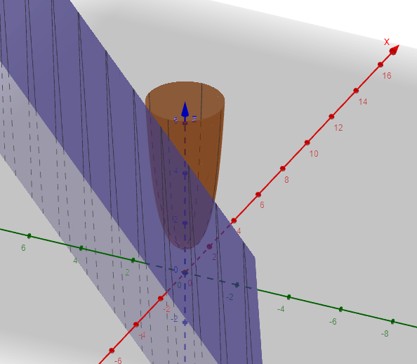

# 1. Determinar el dominio de las siguientes funciones

## a. $f(x,y) = \dfrac {1} {x^2+y^2}$

$Dom(f) = R^2 - {\{(0;0)\}}$

## b. $f(x,y,z) = x^2+2y^2-z^2$

$Dom(f) = R^3$

## c. $f(x,y) = \dfrac {x} {x^2+y^2-9}$

1. $Dom(f) = \{ (x,y) ∈ R^2 : (x^2+y^2-9) \neq 0 \}$
2. $Dom(f) = \{(x,y) ∈ R^2 : (x^2+y^2) \neq 9\}$

## d. $f(x,y) = \dfrac {y} {x^2+y^2+1}$

1. $Dom(f) = \{ (x,y) ∈ R^2 : (x^2+y^2+1) \neq 0 \}$
2. $Dom(f) = \{(x,y) ∈ R^2 :(x^2+y^2) \neq -1\}$

## e. $f(x,y,z) = \dfrac {x^2} {y^2-z^2}$

1. $Dom(f) = \{ (x,y,z) ∈ R^3 : (y^2 - z^2) \neq 0 \}$
2. $Dom(f) = \{ (x,y,z) ∈ R^3 : y^2 \neq z^2 \}$
3. $Dom(f) = \{ (x,y,z) ∈ R^3 : \sqrt {y^2} \neq \sqrt {z^2} \}$
4. $Dom(f) = \{ (x,y,z) ∈ R^3 : |y| \neq |z| \}$

## f. $f(x,y) = \sqrt {9-x^2-y^2}$

1. $Dom(f) = \{ (x,y) ∈ R^2 : (9-x^2-y^2) \ge 0\}$
2. $Dom(f) = \{ (x,y) ∈ R^2 : (-x^2-y^2) \ge (-9)\}$
3. $Dom(f) = \{ (x,y) ∈ R^2 : (-x^2-y^2)(-1) \ge (-9)(-1) \}$
4. $Dom(f) = \{ (x,y) ∈ R^2 : (x^2+y^2) \le 9\}$

*// cuando multiplicás ambos lados por -1 el símbolo cambia de < a > y viceversa.*

## g. $f(x,y) = e^{-x^2+y^2}$

$Dom(f) = R^3$

## h. $f(x,y) = log(16-x^2-16y^2)$

1. $Dom(f) = \{ (x,y) ∈ R^2 : (16-x^2-16y^2) \gt 0\}$
2. $Dom(f) = \{ (x,y) ∈ R^2 : (-x^2-16y^2) \gt -16\}$
3. $Dom(f) = \{ (x,y) ∈ R^2 : (-x^2-16y^2)(-1) \gt (-16)(-1)\}$
4. $Dom(f) = \{ (x,y) ∈ R^2 : (x^2+16y^2) \lt 16\}$

# 2. Evaluar las siguientes funciones en los puntos dados (cuando los puntos pertenezcan al dominio)

## a. $f(x,y) = log(9-x^2-9y^2)$

### En $(1,0)$

$f(1,0) = log(9-1^2-9(0^2))$

$f(1,0) = log(9-1-0)$

$f(1,0) = log(8)$

*// en qué base es el logaritmo? 🤔*

Suponiendo $log _{10}$ $f(1,0) = 0,90308998699$

Suponiendo $log_e$ $f(1,0) = 2,07944154168$

### En $(1,1)$

$f(1,1) = log(9-1^2-9(1^2))$

$f(1,1) = log(9-1-9)$

$f(1,1) = log(-1)$

El logaritmo de un número negativo es indefinido en $R$, por lo que el punto $(1,1) ∉ Dom(f)$.

### En $(0,1)$

$f(0,1) = log(9-0^2-9(1^2))$

$f(0,1) = log(9-9)$

$f(0,1) = log(0)$

El logaritmo de 0 es indefinido en $R$, por lo que el punto $(0,1) ∉ Dom(f)$.

### En $(-1,1)$

$f(-1,1) = log(9-(-1)^2-9.1^2)$

$f(-1,1) = log(9-1-9)$

$f(-1,1) = log(-1)$

El logaritmo de un número negativo es indefinido en $R$, por lo que el punto $(1,1) ∉ Dom(f)$.

## b. $f(x,y) = \sqrt {4-x^2-4y^2}$

### En $(1,0)$

$f(1,0) = \sqrt {4-1^2-4.0^2}$

$f(1,0) = \sqrt {4-1}$

$f(1,0) = \sqrt 3$

$f(1,0) = 1.7320508075689$

### En $(1,1)$

$f(1,1) = \sqrt {4-1^2-4.1^2}$

$f(1,1) = \sqrt {4-1-4}$

$f(1,1) = \sqrt {-1}$

La raíz de un número negativo no está definida en $R$, por lo tanto el punto $(1,1) ∉ Dom(f)$.

### En $(0,1)$

$f(0,1) = \sqrt {4-0^2-4.1^2}$

$f(0,1) = \sqrt {4-0-4}$

$f(0,1) = \sqrt {0}$

$f(0,1) = 0$

### En $(-1,1)$

$f(-1,1) = \sqrt {4-(-1)^2-4.1^2}$

$f(-1,1) = \sqrt {4-1-4}$

$f(-1,1) = \sqrt {-1}$

La raíz de un número negativo no está definida en $R$, por lo tanto el punto $(-1,1) ∉ Dom(f)$.

### En $(2,2)$

$f(2,2) = \sqrt {4-2^2-4.2^2}$

$f(2,2) = \sqrt {4-4-16}$

$f(2,2) = \sqrt {-16}$

La raíz de un número negativo no está definida en $R$, por lo tanto el punto $(2,2) ∉ Dom(f)$.

## c. $f(x,y) = e^{x^2+y^2}$

### En $(1,0)$

$f(1,0) = e^{1^2+0^2}$

$f(1,0) = e^{1}$

$f(1,0) = 2,71828182846$

### En $(1,1)$

$f(1,1) = e^{1^2+1^2}$

$f(1,1) = e^{2}$

$f(1,1) = 7,38905609893$

### En $(0,1)$

$f(1,1) = e^{0^2+1^2}$

$f(1,1) = e^{1}$

$f(1,1) = 2,71828182846$

### En $(-1,1)$

$f(-1,1) = e^{(-1)^2+1^2}$

$f(-1,1) = e^{2}$

$f(-1,1) = 7,38905609893$

# 3. Calcular los siguientes límites o demostrar que no existen

## a. $\lim _{(x,y) \to (3,1)} 5x-x^2+3y^2$

$Dom(f) = R^2$

$(3,1) ∈ Dom(f)$, por lo que su límite se puede evaluar directamente.

1. $\lim_{(x,y) \to (3,1)} 5.3-3^2+3.1^2$

2. $15-9+3 = 9$

Se demostró que el límite para el punto $(3,1)$ existe y su valor es $9$.

## b. $\lim _{(x,y) \to (0,0)} (\dfrac {(7x^2-2y^2)} {x^2+y^2} + 1)$

$Dom(f) = R^2 - \{(0,0)\}$

$(0,0) ∉ Dom(f)$, por lo que su límite no se puede evaluar directamente.

### Límites iterados

A partir de $x$:

1. $\lim _{x \to 0} (\lim _{y \to 0} (\dfrac {7x^2-2y^2} {x^2+y^2} + 1))$

2. $\lim _{x \to 0} (\dfrac {7x^2-2.0^2} {x^2+0^2} + 1)$

3. $\lim _{x \to 0} (\dfrac {7x^2} {x^2} + 1)$

4. $\lim _{x \to 0} (7+ 1)$

5. $\lim _{x \to 0} = 8$

A partir de $y$:

1. $\lim _{y \to 0} (\lim _{x \to 0} (\dfrac {7x^2-2y^2} {x^2+y^2} + 1))$

2. $\lim _{y \to 0} (\dfrac {7.0^2-2y^2} {0^2+y^2} + 1)$

3. $\lim _{y \to 0} (\dfrac {-2y^2} {y^2} + 1)$

4. $\lim _{y \to 0} (-2 + 1)$

5. $\lim _{y \to 0} = -1$

Al acercarse al punto $(0,0)$ por dos caminos distintos se descubrió que los valores son distintos, por lo tanto el límite de $f$ no existe en $(0,0)$.

## c. $\lim _{(x,y,z) \to (1,1,0)} e^{x+y^2-z}$

$Dom(f) = R^3$

$(1,1,0) ∈ Dom(f)$, por lo que su límite se puede evaluar directamente.

1. $\lim _{(x,y,z) \to (1,1,0)} e^{x+y^2-z}$

2. $e^{1+1^2-0}$

3. $e^2$

Se demostró que el límite para el punto $(1,1,0)$ existe y su valor es $e^2$ (*no lo voy a calcular 👽*).

## d. $\lim _{(x,y,z) \to (0,0,0)} \sin(x+y+z)$

$Dom(f) = R^3$

$(0,0,0) ∈ Dom(f)$, por lo que su límite se puede evaluar directamente.

1. $\lim _{(x,y,z) \to (0,0,0)} \sin(x+y+z)$

2. $\sin(0+0+0)$

3. $\sin(0) = 0$

Se demostró que el límite para el punto $(0,0,0)$ existe y su valor es $0$.

## e. $\lim_{(x,y) \to (0,0)} \dfrac {x^4}{x^4+y^4}$

$Dom(f) = R^2 - \{(0,0)\}$

$(0,0) ∉ Dom(f)$, por lo que su límite no se puede evaluar directamente.

### Evaluación algebráica

1. $\lim_{(x,y) \to (0,0)} \dfrac {x^4}{x^4+y^4} = \dfrac {\lim _{(x,y) \to (0,0)} x^4} {\lim _{(x,y) \to (0,0)} x^4 + y^4}$

2. $\dfrac {0^4} {0^4 + 0^4}$

3. $\lim _{(x,y) \to (0,0)} x^4 = L = 0$

3. $\lim _{(x,y) \to (0,0)} x^4 + y^4 = M = 0$

No puede utilizarse la propiedad de límites $L/M$ ya que el denominador es 0; por lo tanto, aún no es suficiente para demostrar la existencia o no del límite.

### Límites iterados

A partir de $x$:

1. $\lim _{x \to 0} (\lim _{y \to 0} \dfrac {x^4}{x^4+y^4})$

2. $\lim _{x \to 0} (\dfrac {x^4} {x^4 + 0^4})$

3. $\lim _{x \to 0} (\dfrac {x^4} {x^4})$

3. $\lim _{x \to 0} = 1$

A partir de $y$:

1. $\lim_{y \to 0} (\lim _{x \to 0} \dfrac {x^4} {x^4+y^4})$

2. $\lim_{y \to 0} (\dfrac {0^4} {0^4+y^4})$

3. $\lim_{y \to 0} (\dfrac {0} {y^4})$

3. $\lim_{y \to 0} = 0$

Al acercarse al punto $(0,0)$ por dos caminos distintos se descubrió que los valores son distintos, por lo tanto el límite de $f$ no existe en $(0,0)$.

## f. $\lim _{(x,y) \to (0,0)} \dfrac {xy} {\sqrt {x^2+y^2} }$

$Dom(f) = R^2 - \{ (0,0) \}$

$(0,0) ∉ Dom(f)$, por lo que su límite no se puede evaluar directamente.

### Evaluación algebráica

1. $\lim _{(x,y) \to (0,0)} \dfrac {xy} {\sqrt {x^2+y^2} } = \dfrac {\lim _{(x,y) \to (0,0)} xy} {\lim _{(x,y) \to (0,0)} \sqrt {x^2+y^2}}$

2. $\dfrac {0.0} {\sqrt {0+0}}$

3. $\lim _{(x,y) \to (0,0)} xy = L = 0$

4. $\lim _{(x,y) \to (0,0)} \sqrt {x^2+y^2} = M = 0$

No puede utilizarse la propiedad de límites $L/M$ ya que el denominador es 0; por lo tanto, aún no es suficiente para demostrar la existencia o no del límite.

Como ambos límites tienden a 0, se puede usar la correspondencia con las coordenadas polares $r \to 0$.

### Coordenadas polares

1. $\lim _{(x,y) \to (0,0)} \dfrac {xy} {\sqrt {x^2+y^2} } = \lim _{r \to 0} \dfrac {r.\cos(\theta).r.\sin(\theta)} {\sqrt {(r.\cos(\theta))^2 + (r.\sin(\theta)^2)}}$

2. $\lim _{r \to 0} \dfrac {r^2.\cos(\theta).\sin(\theta)} {\sqrt {r^2(\cos(\theta)^2 + r^2.\sin(\theta)^2)}}$

3. $\lim _{r \to 0} \dfrac {r^2.\cos(\theta).\sin(\theta)} {\sqrt {r^2(1) }}$ *// acá usé una propiedad que dice que $\cos(\theta)^2 + \sin(\theta)^2 = 1$*

4. $\lim _{r \to 0} \dfrac {r^2.\cos(\theta).\sin(\theta)} {\sqrt {r^2 }}$

5. $\lim _{r \to 0} \dfrac {r^2.\cos(\theta).\sin(\theta)} {|r|}$

6. $\lim _{r \to 0} r.\cos(\theta).\sin(\theta)$

7. $0.\cos(\theta).\sin(\theta)$

8. $0$

Se demostró que el límite en el punto $(0,0)$ existe y su valor es $0$.

## g. $\lim _{(x,y) \to (2,2)} \dfrac {x^2-2xy+y^2} {x-y}$

$Dom(f) = (x,y) ∈ R^2 : (x - y) \neq 0$

$Dom(f) = \{ (x,y) ∈ R^2 : x \neq y \}$

$(2,2) ∉ Dom(f)$, por lo que el límite no puede evaluarse directamente.

### Evaluación algebráica

1. $\lim _{(x,y) \to (2,2)} \dfrac {x^2-2xy+y^2} {x-y} = \dfrac {(x-y)^2} {x-y}$

2. $\lim _{(x,y) \to (2,2)} x-y$

3. $2-2 = 0$

Se demostró que el límite en el punto $(2,2)$ existe y su valor es $0$.

# 4. Estudiar la continuidad de las siguientes funciones. En caso de no estar definida en todo $R^2$, redefinirla de manera que pueda extenderse su continuidad.

## a.

* $f(x,y) = {\dfrac {x^3} {\sqrt {x^2+y^2}}}$ si $(x,y) \neq (0,0)$
* $f(x,y) = 1$ si $(x,y) = (0,0)$

$Dom(f) = R^2$.

El punto que cuestiona la continuidad de $f$ es $(0,0)$. Para esto se buscará encontrar el límite de $f$ en dicho punto, y que éste coincida con el valor exacto en la coordenada.

1. $\lim _{(x,y) \to (0,0)} {\dfrac {x^3} {\sqrt {x^2+y^2}}} = \lim _{r \to 0} \dfrac {(r.\cos(\theta))^3} {\sqrt {(r.\cos(\theta))+(r.\sin(\theta))}}$

2. $\lim _{r \to 0} \dfrac {r^3\cos(\theta)^3} {\sqrt {r^2.\cos(\theta)^2+r^2.\sin(\theta)^2}}$

3. $\lim _{r \to 0} \dfrac {r^3\cos(\theta)^3} {\sqrt {r^2(\cos(\theta)+\sin(\theta))}}$

4. $\lim _{r \to 0} \dfrac {r^3\cos(\theta)^3} {\sqrt {r^2.1}}$

5. $\lim _{r \to 0} \dfrac {r^3\cos(\theta)^3} {r}$

6. $\lim _{r \to 0} r^2\cos(\theta)^3$

7. $0.\cos(\theta)^3$

8. $0$

Se demostró que el límite en el punto $(0,0)$ existe y su valor es $0$.

Para que $f$ sea continua en $(0,0)$ debe cumplirse que $\lim _{(x,y) \to (0,0)} =f(0,0)$. Sin embargo, el valor de $f(0,0) = 1$, por lo tanto $f$ no es continua en ese punto.

Para resolver la discontinuidad debe reformularse $f$ tal que:
* $f(x,y) = {\dfrac {x^3} {\sqrt {x^2+y^2}}}$ si $(x,y) \neq (0,0)$
* $f(x,y) = 0$ si $(x,y) = (0,0)$

## b.

* $f(x,y) = {\dfrac {x} {\sqrt {x^2+y^2}}}$ si $(x,y) \neq (0,0)$
* $f(x,y) = 0$ si $(x,y) = (0,0)$

$Dom(f) = R^2$.

El punto que cuestiona la continuidad de $f$ es $(0,0)$. Para esto se buscará encontrar el límite de $f$ en dicho punto, y que éste coincida con el valor exacto en la coordenada.

1. $\lim _{(x,y) \to (0,0)} {\dfrac {x} {\sqrt {x^2+y^2}}} = \lim _{r \to 0} \dfrac {r.\cos(\theta)} { \sqrt {(r.\cos(\theta))^2+(r.\sin(\theta))^2} }$

2. $\lim _{r \to 0} {\dfrac {r.\cos(\theta)} { \sqrt {r^2.\cos(\theta)^2+r^2.\sin(\theta)^2} }}$

3. $\lim _{r \to 0} {\dfrac {r.\cos(\theta)} { \sqrt {r^2(\cos(\theta)^2+.\sin(\theta)^2)} }}$

4. $\lim _{r \to 0} {\dfrac {r.\cos(\theta)} { \sqrt {r^2(1)} }}$

5. $\lim _{r \to 0} \dfrac {r.\cos(\theta)} {r}$

6. $\lim _{r \to 0} \cos(\theta)$

7. $\cos(\theta)$

Al calcular el límite en el punto $(0,0)$ se llegó a un resultado en el cual su valor depende de $\theta$, por lo tanto el límite no existe.

Como el límite de $f(0,0)$ no existe, se dice que $f$ no es continua en ese punto y no puede redefinirse.

## c.

* $f(x,y) = {\dfrac {x^2} {\sqrt {x^2+y^2}}}$ si $(x,y) \neq (0,0)$
* $f(x,y) = 0$ si $(x,y) = (0,0)$

$Dom(f) = R^2$

El punto que cuestiona la continuidad de $f$ es $(0,0)$. Para esto se buscará encontrar el límite de $f$ en dicho punto, y que éste coincida con el valor exacto en la coordenada.

1. $\lim _{(x,y) \to (0,0)} {\dfrac {x^2} {\sqrt {x^2+y^2}}} = \lim _{r \to 0} \dfrac {(r.\cos(\theta))^2} {\sqrt {(r.\cos(\theta))^2 + (r.\sin(\theta))^2}}$

2. $\lim _{r \to 0} \dfrac {(r.\cos(\theta))^2} {\sqrt {r^2.\cos(\theta)^2 + r^2.\sin(\theta)^2} }$

3. $\lim _{r \to 0} \dfrac {r^2.\cos(\theta)^2} {\sqrt {r^2(\cos(\theta)^2 + \sin(\theta)^2)} }$

4. $\lim _{r \to 0} \dfrac {r^2.\cos(\theta)^2} {\sqrt {r^2(1)} }$

5. $\lim _{r \to 0} \dfrac {r^2.\cos(\theta)^2} {r}$

6. $\lim _{r \to 0} r.\cos(\theta)^2$

7. $0.\cos(\theta)^2$

8. $0$

Se demostró que el límite en el punto $(0,0)$ existe y su valor es $0$.

Para que $f$ sea continua en $(0,0)$ debe cumplirse que $\lim _{(x,y) \to (0,0)} =f(0,0)$. En este caso, tanto el límite como el valor exacto en el punto son $0$, por lo que $f$ es continua en $(0,0)$.

## d.

$f(x,y) = \dfrac {xy} {x^2+y^2}$

$Dom(f) = R^2 -\{ (0,0) \}$

Como $(0,0)$ está fuera de $Dom(f)$, la función no es continua para todo $R^2$. A pesar de esto, se calculará su límite en dicho punto para ver si puede redefinirse $f$ de manera que sea continua para todo $R^2$.

1. $\lim _{(x,y) \to (0,0)} \dfrac {xy} {x^2+y^2} = \lim _{r \to 0} \dfrac {r.\cos(\theta).r.\sin(\theta)} {(r.\cos(\theta))^2+(r.\sin(\theta))^2}$

2. $\lim _{r \to 0} \dfrac {r^2.\cos(\theta).\sin(\theta)} {r^2.\cos(\theta)^2+r^2.\sin(\theta)^2}$

3. $\lim _{r \to 0} \dfrac {r^2.\cos(\theta).\sin(\theta)} {r^2(\cos(\theta)^2+\sin(\theta)^2)}$

4. $\lim _{r \to 0} \dfrac {r^2.\cos(\theta).\sin(\theta)} {r^2.1}$

4. $\lim _{r \to 0} \cos(\theta).\sin(\theta)$

4. $\cos(\theta).\sin(\theta)$

Al calcular el límite en $(0,0)$, se llegó a un resultado que depende totalmente del valor de $\theta$, por lo tanto el límite no existe y $f$ no puede redefinirse para ser continua en dicho punto.

## e.

$f(x,y) = \dfrac {xy^2} {x^2+y^2}$

$Dom(f) = R^2 -\{ (0,0) \}$

Como $(0,0)$ está fuera de $Dom(f)$, la función no es continua para todo $R^2$. A pesar de esto, se calculará su límite en dicho punto para ver si puede redefinirse $f$ de manera que sea continua para todo $R^2$.

1. $\lim _{(x,y) \to (0,0)} \dfrac {xy^2} {x^2+y^2} = \lim _{r \to 0} \dfrac {r.\cos(\theta)(r.\sin(\theta))^2} {(r.\cos(\theta))^2+(r.\sin(\theta))^2}$

2. $\lim _{r \to 0} \dfrac {r.\cos(\theta).r^2.\sin(\theta)^2} {r^2.\cos(\theta)^2+r^2.\sin(\theta)^2}$

3. $\lim _{r \to 0} \dfrac {r^3.\cos(\theta).\sin(\theta)^2} {r^2(\cos(\theta)^2+\sin(\theta)^2)}$

4. $\lim _{r \to 0} \dfrac {r^3.\cos(\theta).\sin(\theta)^2} {r^2(1)}$

5. $\lim _{r \to 0} r.\cos(\theta).\sin(\theta)^2$

6. $0.\cos(\theta).\sin(\theta)^2$

7. $0$

Se encontró que el límite de $f(0,0)$ existe y su valor es $0$. Por lo tanto, $f$ puede redefinirse para que sea continua en todo $R^2$ de la siguiente manera:

* $f(x,y) = {\dfrac {xy^2} {x^2+y^2}}$ si $(x,y) \neq (0,0)$
* $f(x,y) = 0$ si $(x,y) = (0,0)$

# 5. Encontrar las derivadas parciales primeras de las siguientes funciones, indicando sus dominios

## a. $3x^2y+y^3$

*// no sé a qué se refiere con "primeras" así que voy a hacer lo que dice la teoría*

$Dom(f) = R^2$

### Derivada respecto a $x$

1. $\dfrac {df(x,y)} {dx} = \dfrac {d(3x^2y+y^3)} {dx}$

2. $3.2x.y+y^3$

3. $6xy+y^3$

$Dom(\dfrac {df(x,y)} {dx}) = R^2$

### Derivada respecto a $y$

1. $\dfrac {df(x,y)} {dy} = \dfrac {d(3x^2y+y^3)} {dy}$

2. $3x^2.1.y^0+3y^2$

3. $3x^2+3y^2$

$Dom(\dfrac {df(x,y)} {dy}) = R^2$

## b. $f(x,y,z) = x^2y+y^2z+z^2x$

$Dom(f) = R^3$

### Derivada respecto a $x$

1. $\dfrac {df(x,y,z)} {dx} = \dfrac {d(x^2y+y^2z+z^2x)} {dx}$

2. $2xy+0+z^2(x^0)$

3. $2xy+z^2$

$Dom(\dfrac {df(x,y,z)} {dx}) = R^3$

### Derivada respecto a $y$

1. $\dfrac {df(x,y,z)} {dy} = \dfrac {d(x^2y+y^2z+z^2x)} {dy}$

2. $x^2(y^0) + 2yz + 0$

3. $x^2+2yz$

$Dom(\dfrac {df(x,y,z)} {dy}) = R^3$

### Derivada respecto a $z$

1. $\dfrac {df(x,y,z)} {dz} = \dfrac {d(x^2y+y^2z+z^2x)} {dz}$

2. $0+y^2(z^0)+2zx$

3. $y^2+2zx$

$Dom(\dfrac {df(x,y,z)} {dz}) = R^3$

## c. $f(x,y) = e^{xy} + \sin(x^2+y)$

$Dom(f) = R^2$

### Derivada respecto a $x$

*// lo voy a hacer paso x paso porque no me acuerdo las derivadas compuestas*

1. $\dfrac {df(x,y)} {dx} = \dfrac {d(e^{xy}+\sin(x^2+y))} {dx}$

2. $\dfrac {d(e^{xy})} {dx} + \dfrac {d(sin(x^2+y))} {dx}$

3. $\dfrac {d(e^{xy})} {dx}.\dfrac {d(xy)} {dx} + \dfrac {d(\sin(x^2+y))} {dx}.\dfrac {d(x^2+y)} {dx}$

4. $e^{xy}.(y(x^0)) + cos(x^2+y). (\dfrac{d(x^2)} {dx} + \dfrac {y} {dx})$

5. $e^{xy}(y) + cos(x^2+y).(2x+0)$

6. $ye^{xy} + 2x.cos(x^2+y)$

$Dom(f) = R^2$

### Derivada respecto a $y$

1. $\dfrac {df(x,y)} {dy} = \dfrac {d(e^{xy}+\sin(x^2+y))} {dy}$

2. $\dfrac {d(e^{xy})} {dy} + \dfrac {sin(x^2+y)} {dy}$

3. $e^{xy}.(x(y^0)) + cos(x^2+y)(1)$

4. $xe^{xy} + cos(x^2+y)$

$Dom(f) = R^2$

## d. $\dfrac {xy} {x^2+y^2}$

$Dom(f) = R^2 - \{ (0,0) \}$

### Derivada respecto a $x$

1. $\dfrac {df(x,y)} {dx} = \dfrac {d(\dfrac {xy} {x^2+y^2})} {dx}$

2. $\dfrac {(x^2+y^2)(\dfrac {d} {dx}xy)- (xy)(\dfrac {d} {dx}(x^2+y^2))} {(x^2+y^2)^2}$

3. $\dfrac {(x^2+y^2)(x^0y) - (xy)(2x + \dfrac {d} {dx}y^2)} {(x^2+y^2)^2}$

4. $\dfrac {(x^2+y^2)(y) - (xy)(2x)} {(x^2+y^2)^2}$

5. $\dfrac {(x^2y+y^3) - (2x^2y)} {(x^2+y^2)^2}$

6. $\dfrac {x^2y+y^3 - 2x^2y} {(x^2+y^2)^2}$

7. $\dfrac {y(x^2-2x^2+y^2)} {(x^2+y^2)^2}$

8. $\dfrac {y(y^2-x^2)} {(x^2+y^2)^2}$

$Dom(f) = R^2 - \{ (0,0) \}$

### Derivada respecto a $y$

1. $\dfrac {df(x,y)} {dy} = \dfrac {d(\dfrac {xy} {x^2+y^2})} {dy}$

2. $\dfrac {(x^2+y^2)(\dfrac {d} {dy}xy)- (xy)(\dfrac {d} {dy}(x^2+y^2))} {(x^2+y^2)^2}$

3. $\dfrac {(x^2+y^2)(x(y^0))-(xy)(0+2y)} {(x^2+y^2)^2}$

4. $\dfrac {(x^2+y^2)x-xy(2y)} {(x^2+y^2)^2}$

5. $\dfrac {x^3+xy^2-2xy^2} {(x^2+y^2)^2}$

6. $\dfrac {x^3 + (xy^2)(1-2)} {(x^2+y^2)^2}$

7. $\dfrac {x^3 + (xy^2)(-1)} {(x^2+y^2)^2}$

8. $\dfrac {x^3 - xy^2} {(x^2+y^2)^2}$

$Dom(f) = R^2 - \{ (0,0) \}$

## e. $f(x,y) = x^2log(x+y)$

$Dom(f) = (x,y) ∈ R^2 : (x+y) \gt 0$

### Derivada respecto a $x$

*// de nuevo no sé en qué base son los logaritmos así que supongo base 10*

1. $\dfrac {df(x,y)} {dx} = \dfrac {d(x^2log(x+y))} {dx}$

2. $\dfrac {d(x^2)} {dx}.log(x+y) + \dfrac {log(x+y)} {dx}.x^2$

3. $2x.log(x+y) + \dfrac {1} {(x+y).ln(10)}.\dfrac{d(x+y)} {dx}.x^2$

3. $2x.log(x+y) + \dfrac {1} {(x+y).ln(10)}.x^2$

4. $2x.log(x+y) + \dfrac {2x} {(x+y).ln(10)}$

$Dom(f) = (x,y) ∈ R^2 : (x+y) /gt 0$

### Derivada respecto a $y$

1. $\dfrac {df(x,y)} {dy} = \dfrac {d(x^2log(x+y))} {dy}$

2. $\dfrac {d(x^2)} {dy}.log(x+y) + \dfrac {log(x+y)} {dy}.x^2$

3. $0.log(x+y) + \dfrac {1} {(x+y).ln(10)}.\dfrac {d(x+y)} {dy}.x^2$

3. $0 + \dfrac {1} {(x+y).ln(10)}.1.x^2$

3. $\dfrac {x^2} {(x+y).ln(10)}$

$Dom(f) = (x,y) ∈ R^2 : (x+y) \gt 0$

## f. $f(x,y) = \sum {(y_i - (x+y_i))^2}$

*// este no lo voy a hacer*

# 6. Calcular las derivadas parciales primeras de las siguientes funciones en los puntos indicados

## a. $f(x,y) = x.e^{x^2y}$ en $(1,log(2))$

$Dom(f) = R^2$

### Derivada respecto a $x$

1. $\dfrac {df(x,y)} {dx} = \dfrac {d(x.e^{x^2y})} {dx}$

2. $\dfrac{d(x)} {dx}.e^{x^2y} + \dfrac {d(e^{x^2y})} {dx}.x$

3. $(x^0)e^{x^2y}+e^{x^2y}.\dfrac{d(x^2y)} {dx}.x$

4. $e^{x^2y}+e^{x^2y}.2xy.x$

4. $e^{x^2y} + 2x^2ye^{x^2y}$

$Dom(f) = R^2$

### Derivada respecto a $y$

1. $\dfrac {df(x,y)} {dy} = \dfrac {d(x.e^{x^2y})} {dy}$

2. $\dfrac{d(x)} {dy}.e^{x^2y} + \dfrac {d(e^{x^2y})} {dy}.x$

3. $0.e^{x^2y} + e^{x^2y}.\dfrac {d(x^2y)} {dy}.x$

4. $0 + e^{x^2y}.(y^0x^2).x$

5. $e^{x^2y}.x^2.x

6. $x^3e^{x^2y}$

$Dom(f) = R^2$

### Cálculo en $(1,log(2))$

*// a partir de acá empecé a sospechar que el $log$ es base $e$ así que voy a usar ese*

1. $f_x(1,log(2)) = e^{1^2.log(2)} + 2.1^2(log(2))e^{1^2.log(2)}$

2. $f_x(1,log(2)) = e^{log(2)} + 2(log(2)).e^{log(2)}$

3. $f_x(1,log(2)) = 2  + 2(log(2))2$

3. $f_x(1,log(2)) = 2  + 4(0,693)$

5. $f_x(1,log(2)) = 4,772$

---

1. $f_y(1,log(2)) = 1^3.e^{1^2log(2)}$

2. $f_y(1,log(2)) = e^{log(2)}$

3. $f_y(1,log(2)) = 2$

## b. $f(x,y) = \sqrt {x^2+y^2}$ en $(-4,3)$

$Dom(f) = (x,y) ∈ R^2 : (x^2+y^2) \ge 0$

$Dom(f) = R^2$ porque la suma de 2 números positivos siempre es positiva ☝🤓

### Derivada respecto a $x$

1. $\dfrac {df(x,y)} {dx} = \dfrac {d(\sqrt {x^2 + y^2})} {dx}$

2. $\dfrac {1} {2 \sqrt {x^2+y^2}}.\dfrac {d(x^2+y^2)} {dx}$ *por regla de derivación de raíces*

3. $\dfrac {1} {2\sqrt{x^2+y^2}}.2x$

4. $\dfrac {2x} {2\sqrt{x^2+y^2}}$

5. $\dfrac {x} {\sqrt {x^2+y^2}}$

$Dom(f) = (x,y) ∈ R^2 : (x,y) \neq (0,0)$

### Derivada respecto a $y$

1. $\dfrac {df(x,y)} {dy} = \dfrac {d(\sqrt {x^2 + y^2})} {dy}$

2. $\dfrac {1} {2 \sqrt {x^2+y^2}}.\dfrac {d(x^2+y^2)} {dy}$

3. $\dfrac {1} {2 \sqrt {x^2+y^2}}.2y$

4. $\dfrac {2y} {2 \sqrt{x^2+y^2}}$

5. $\dfrac {y} {\sqrt{x^2+y^2}}$

$Dom(f) = (x,y) ∈ R^2 : (x,y) \neq (0,0)$

## Cálculo en $(-4,3)$

1. $f_x(-4,3) = \dfrac {-4} {\sqrt {(-4)^2+3^2}}$

2. $f_x(-4,3) = \dfrac {-4} {\sqrt {16+9}}$

2. $f_x(-4,3) = \dfrac {-4} {5}$

4. $f_x(-4,3) = -0,8$

---

1. $f_y(-4,3) = \dfrac {3} {\sqrt {(-4)^2+3^2}}$

2. $f_y(-4,3) = \dfrac {3} {\sqrt {16+9}}$

3. $f_y(-4,3) = \dfrac {3} {5}$

4. $f_y(-4,3) = 0,6$

# 7. Analizar la diferenciabilidad en $R^2$ de las siguientes funciones

## a. $f(x,y) = \sin(x^2+y^2)$

$Dom(f) = R^2$

Como $f$ es continua en todo $R^2$, para demostrar que es diferenciable sus derivadas parciales deben existir y ser continuas en $R^2$.

### Derivada respecto a $x$

1. $\dfrac {df(x,y)} {dx} = \dfrac {d(sin(x^2+y^2))} {dx}$

2. $cos(x^2+y^2).\dfrac {d(x^2+y^2)} {dx}$

3. $cos(x^2+y^2).2x$

$Dom(f) = R^2$

### Derivada respecto a $y$

1. $\dfrac {df(x,y)} {dy} = \dfrac {d(sin(x^2+y^2))} {dy}$

2. $cos(x^2+y^2).\dfrac {d(x^2+y^2)} {dy}$

3. $cos(x^2+y^2).2y$

$Dom(f) = R^2$

Ambas derivadas parciales son continuas sobre $R^2$, por lo que $f$ es diferenciable.

## b. $f(x,y) = \sqrt {x^2+y^2}$

$Dom(f) = (x,y) ∈ R^2 : (x^2+y^2) \ge 0$

$Dom(f) = R^2$ ya que al sumar potencias de 2 $(x^2+y^2)$ siempre será un número positivo.

Como $f$ es continua en todo $R^2$, para demostrar que es diferenciable es necesario encontrar sus derivadas parciales y que éstas sean continuas en $R^2$.

### Derivada respecto a $x$

1. $\dfrac {df(x,y)} {dx} = \dfrac {d(\sqrt {x^2+y^2})} {dx}$

2. $\dfrac {1} {2\sqrt{x^2+y^2}}. \dfrac {d(x^2+y^2)} {dx}$

3. $\dfrac {1} {2\sqrt{x^2+y^2}}.2x$

4. $\dfrac {2x} {2\sqrt {x^2+y^2}}$

5. $\dfrac {x} {\sqrt {x^2+y^2}}$

$Dom(f) = R^2 - \{ (0,0) \}$

Se encontró una derivada parcial de $f$ la cual no es continua para un punto dentro de $R^2$, por lo que $f$ no es diferenciable para todo el dominio.

*// con una alcanza para la demostración, pero igual voy a hacer la otra*

### Derivada respecto a $y$

1. $\dfrac {df(x,y)} {dy} = \dfrac {d(\sqrt {x^2+y^2})} {dy}$

2. $\dfrac {1} {2\sqrt{x^2+y^2}}. \dfrac {d(x^2+y^2)} {dy}$

3. $\dfrac {1} {2\sqrt{x^2+y^2}}.2y$

4. $\dfrac {2y} {2\sqrt {x^2+y^2}}$

5. $\dfrac {y} {\sqrt {x^2+y^2}}$

$Dom(f) = R^2 - \{ (0,0) \}$

Las derivadas parciales de $f$ no existen para el punto $(0,0)$, por lo tanto la función no es diferenciable para todo $R^2$.

## c.

$f(x,y) = \dfrac {xy} {x^2+y^2}$ si $(x,y) \neq (0,0)$

$f(x,y) = 0$ si $(x,y) = (0,0)$

$Dom(f) = R^2$

A partir de la definición de $f$ podemos ver que, si bien su dominio es $R^2$, el punto que podría presentar conflictos es $(0,0)$. Para esto se analizarán las derivadas parciales en dicho punto.

Al tratarse de una función por trozos, las derivadas parciales deben resolverse mediante la definición.

### Derivada respecto a $x$

1. $f_x(0,0) = \lim _{h \to 0} \dfrac {f(0+h,0) - f(0,0)} {h}$

2. $\lim_{h \to 0} \dfrac {f(h,0) - 0} {h}$

3. $\lim _{h \to 0} {\dfrac {h^2.0} {h^2+0^2}}.\dfrac 1 h$ *// saqué el $h$ para el costado porque me costaba entender la fracción*

4. $\lim _{h \to 0} {\dfrac {0} {h^2}} .\dfrac {1} {h}$

5. $\dfrac {0} {h^3}$

6. $\lim _{h \to 0} = 0$

### Derivada respecto a $y$

1. $f_y(0,0) = \lim _{k \to 0} \dfrac {f(0, 0+k) - f(0,0)} {k}$

2. $\lim _{h \to 0} \dfrac {f(0,k) - 0} {k}$

3. $\lim _{h \to 0} \dfrac {0(k^2)} {0^2+k^2}. \dfrac 1 k$

4. $\dfrac {0} {k^2} . \dfrac 1 k$

5. $\dfrac 0 {k^3}$

6. $\lim _{k \to 0} \dfrac 0 {k^3} = 0$

### Diferenciabilidad en $(0,0)$

Se demostró que ambas derivadas parciales existen para  $(0,0)$, por lo que se probará su diferenciabilidad en el punto.

Siguiendo la definición de diferenciabilidad:

$ \lim _{(x,y) \to (1,y_0)}\dfrac {f(x,y) - [\dfrac {df(x_0, y_0)} {dx}(x-x_0) + \dfrac {d(x_0, y_0)} {dy}(y-y_0)+f(x_0,y_0)]} {\sqrt{(x-x_0)^2+(y-y_0)^2}} = 0$

Se demostrará la diferenciabilidad en $(0,0)$.

1. $\lim _{(x,y) \to (0,0)} \dfrac {f(x,y)-[0(x-0)+0(y-0)+f(0,0)]} {\sqrt {(x-0)^2+(y-0)^2}}$

2. $\lim _{(x,y) \to (0,0)} \dfrac {\dfrac {xy} {x^2+y^2}-[0+0+0]} {\sqrt {(x-0)^2+(y-0)^2}}$

3. $\lim _{(x,y) \to (0,0)} \dfrac { \dfrac {xy} {x^2+y^2}} {\sqrt {x^2+y^2}}$

4. $\lim _{(x,y) \to (0,0) \dfrac {xy} {(x^2+y^2) \sqrt {x^2+y^2}}}$

5. $\lim _{(x,y) \to (0,0) \dfrac {xy} {(x^2+y^2)(x^2+y^2)^{1/2}}}$

6. $\lim _{(x,y) \to (0,0) \dfrac {xy} {(x^2+y^2)^{3/2}}}$

A partir de este punto se usará la relación con coordenadas polares para simplificar el resultado del límite.

7. $\lim _{r \to 0} \dfrac {r.\cos(\theta).r.\sin(\theta)} {((r.\cos(\theta)^2)+(r.\sin(\theta))^2)^{3/2}}$

8. $\lim _{r \to 0} \dfrac {r.^2\cos(\theta).\sin(\theta)} {(r^2.\cos(\theta)^2+r^2.\sin(\theta)^2)^{3/2}}$

9. $\lim _{r \to 0} \dfrac {r.^2\cos(\theta).\sin(\theta)} {(r^2(\cos(\theta)^2+\sin(\theta)^2))^{3/2}}$

10. $\lim _{r \to 0} \dfrac {r.^2\cos(\theta).\sin(\theta)} {(r^2)^{3/2}}$

11. $\lim _{r \to 0} \dfrac {r.^2\cos(\theta).\sin(\theta)} {r^2}.\dfrac 1 r$

12. $\lim _{r \to 0} \cos(\theta).\sin(\theta).\dfrac 1 r$

13. $\lim _{r \to 0} \dfrac {\cos(\theta).\sin(\theta)} {r}$

14. $\dfrac {\cos(\theta).\sin(\theta)} {0}$

Se llegó a la conclusión de que el resultado del límite es indeterminado, por lo tanto no existe y $f$ no es diferenciable en $(0,0)$.

## d.

$f(x,y) = \dfrac {xy^2} {x^2+y^2}$ si $(x,y) \neq (0,0)$

$f(x,y) = 0$ si $(x,y) = (0,0)$

A partir de la definición de $f$ podemos ver que, si bien su dominio es $R^2$, el punto que podría presentar conflictos es $(0,0)$. Para esto se analizarán las derivadas parciales en dicho punto.

Al tratarse de una función por trozos, las derivadas parciales deben resolverse mediante la definición.

### Derivada respecto a $x$

1. $f_x(0,0) = \lim _{h \to 0} \dfrac {f(0+h,0) - f(0,0)} {h}$

2. $f_x(0,0) = \lim _{h \to 0} \dfrac {f(h,0) - 0} {h}$

3. $f_x(0,0) = \lim _{h\to 0} \dfrac {\dfrac {h.0^2} {h^2+0^2}} {h}$

4. $f_x(0,0) = \lim _{h \to 0} \dfrac {h.0^2} {h^2+0^2}. \dfrac {1} {h}$

5. $f_x(0,0) = \lim _{h \to 0} \dfrac {0} {h^3}$

6. $f_x(0,0) = 0$

### Derivada respecto a $y$

1. $f_y(0,0) = \lim _{k \to 0} \dfrac {f(0,0+k) - f(0,0)} {k}$

2. $f_y(0,0) = \lim _{k \to 0} \dfrac {f(0,k)-0} {k}$

3. $f_y(0,0) = \lim _{k \to 0} \dfrac {\dfrac {0.k^2} {0^2+k^2}} {k}$

4. $f_y(0,0) = \lim _{k \to 0} \dfrac {0.k^2} {0^2+k^2} . \dfrac {1} {k}$

5. $f_y(0,0) = \lim _{k \to 0} \dfrac {0} {k^3}$

6. $f_y(0,0) = 0$

### Diferenciabilidad en $(0,0)$

Se demostró que ambas derivadas parciales existen para  $(0,0)$, por lo que se probará su diferenciabilidad en el punto:

1. $\lim _{(x,y) \to (x_0,y_0)}\dfrac {f(x,y) - [\dfrac {df(x_0, y_0)} {dx}(x-x_0) + \dfrac {d(x_0, y_0)} {dy}(y-y_0)+f(x_0,y_0)]} {\sqrt{(x-x_0)^2+(y-y_0)^2}}$

2. $\lim _{(x,y) \to (0,0)} \dfrac {f(x,y)-[0(x-0)+0(y-0)+f(0,0)]} {\sqrt {(x-0)^2+(y-0)^2}}$

3. $\lim _{(x,y) \to (0,0)} \dfrac {f(x,y)-0+0+0} {\sqrt {(x-0)^2+(y-0)^2}}$

4. $\lim _{(x,y) \to (0,0)} \dfrac {\dfrac {xy^2} {x^2+y^2}} {\sqrt {x^2+y^2}}$

5. $\lim _{(x,y) \to (0,0)} \dfrac {xy^2} {x^2+y^2}.\dfrac {1} {\sqrt {x^2+y^2}}$

6. $\lim _{(x,y) \to (0,0)} \dfrac {xy^2} {(x^2+y^2)(\sqrt {x^2+y^2})}$

7. $\lim _{(x,y) \to (0,0)} \dfrac {xy^2} {(x^2+y^2)(x^2+y^2)^{1/2}}$

8. $\lim _{(x,y) \to (0,0)} \dfrac {xy^2} {(x^2+y^2)^{3/2}}$

Dado el término $(x^2+y^2)^{3/2}$, puede realizarse la conversión a coordenadas polares:

9. $\lim _{r \to 0} \dfrac {(r.\cos(\theta))(r.\sin(\theta))^2} {((r.\cos(\theta))^2+(r.\sin(\theta))^2)^{3/2}}$

10. $\lim _{r \to 0} \dfrac {r.\cos(\theta).r^2.\sin(\theta)^2} {(r^2(\cos(\theta)^2+\sin(\theta)^2))^{3/2}}$

11. $\lim _{r \to 0} \dfrac {r.\cos(\theta).r^2.\sin(\theta)^2} {(r^2(1))^{3/2}}$

12. $\lim _{r \to 0} \dfrac {r^3.\cos(\theta).\sin(\theta)^2} {r^3}$

13. $\lim _{r \to 0} \cos(\theta)\sin(\theta)^2$

14. $\cos(\theta)\sin(\theta)^2$

Si bien se encontró el límite, éste depende del valor de $\theta$, por lo que varía según la dirección de aproximación al origen. Por lo tanto, $f$ no es diferenciable.

*// ☝🤓 una cosa en este ej: siempre me olvido de que existe la conversión $r = \sqrt {x^2+y^2}$, así que los pasos 10 a 12 me los podría haber salteado*

## e.

$f(x,y) = \dfrac {xy} {\sqrt {x^2+y^2}}$ si $(x,y) \neq (0,0)$

$f(x,y) = 0$ si $(x,y) = (0,0)$

A partir de la definición de $f$ se puede ver que podría haber un conflicto a la diferenciabilidad en el punto $(0,0)$. Como se trata de una función a trozos, primero se calcularán las derivadas en ese punto.

### Derivada respecto a $x$

1. $f_x(0,0) = \lim _{h \to 0} \dfrac {f(0+h,0) - f(0,0)} {h}$

2. $f_x(0,0) = \lim _{h \to 0} \dfrac {f(h,0) - 0} {h}$

3. $f_x(0,0) = \lim _{h \to 0} \dfrac {\dfrac {h.0} {\sqrt {h^2+0^2}} - 0} {h}$

4. $f_x(0,0) = \lim _{h \to 0} \dfrac {0} {\sqrt {h^2+0}}.\dfrac 1 h$

5. $f_x(0,0) = \lim _{h \to 0} \dfrac {0} {h\sqrt {h^2}}$

6. $f_x(0,0) = \lim _{h \to 0} \dfrac {0} {h^2}$

8. $f_x(0,0) = 0$

### Derivada respecto a $y$

1. $f_y(0,0) = \lim _{k \to 0} \dfrac {f(0,0+k) - f(0,0)} {k}$

2. $f_y(0,0) = \lim _{k \to 0} \dfrac {f(0,k) - 0} {k}$

3. $f_y(0,0) = \lim _{k \to 0} \dfrac {\dfrac {0k} {\sqrt {0^2 + k^2}}} {k}$

4. $f_y(0,0) = \lim _{k \to 0} \dfrac {0} {\sqrt {0^2+k^2}}.\dfrac 1 k$

5. $f_y(0,0) = \lim _{k \to 0} \dfrac {0} {k\sqrt{k^2}}$

6. $f_y(0,0) = \lim _{k \to 0} \dfrac 0 {k^2}$

7. $f_y(0,0) = 0$

### Diferenciabilidad en $(0,0)$

Ambas derivadas existen en el punto, por lo que se procederá a calcular su diferenciabilidad en $(0,0)$:

1. $\lim _{(x,y) \to (x_0,y_0)}\dfrac {f(x,y) - [\dfrac {df(x_0, y_0)} {dx}(x-x_0) + \dfrac {d(x_0, y_0)} {dy}(y-y_0)+f(x_0,y_0)]} {\sqrt{(x-x_0)^2+(y-y_0)^2}}$

2. $\lim _{(x,y) \to (0,0)} \dfrac {f(x,y) -[0(x-0)+0(y-0)+0]} {\sqrt {(x-0)^2 + (y-0)^2}}$

3. $\lim _{(x,y) \to (0,0)} \dfrac {f(x,y)-0} {\sqrt {x^2+y^2}}$

4. $\lim _{(x,y) \to (0,0)} \dfrac {\dfrac {xy} {\sqrt {x^2+y^2}}} {\sqrt {x^2+y^2}}$

5. $\lim _{(x,y) \to (0,0)} \dfrac {xy} {\sqrt {x^2+y^2}} . \dfrac 1 {\sqrt{x^2+y^2}}$

6. $\lim_{(x,y) \to (0,0)} \dfrac {xy} {x^2+y^2}$

A partir de ahora se aprovechará la conversión a coordenadas polares para simplificar el cálculo del límite:

7. $\lim _{r \to 0} \dfrac {(r.\cos(\theta).r.\sin(\theta))} {r^2}$

8. $\lim _{r \to 0} \dfrac {r^2\cos(\theta)\sin(\theta)} {r^2}$

9. $\lim _{r \to 0} \cos(\theta)\sin(\theta)$

Si bien se encontró el límite, éste depende del valor de $\theta$, por lo que varía según la dirección de aproximación al origen. Por lo tanto, $f$ no es diferenciable.

# 8. Hallar, si es que existe, el plano tangente a la gráfica de $f(x,y) = e^{x^2+y^2}$ en el punto $(-1,1,f(-1,1))$.

$Dom(f) = R^2$ (continua en todo $R^2$ ya que es una función exponencial)

Primero se deben obtener las derivadas parciales de $f(x,y)$ en el punto $(-1,1)$.

### Derivada respecto a $x$

$\dfrac {df(x,y)} {dx} = \dfrac {d(e^{x^2+y^2})} {dx}$

1. $e^{x^2+y^2}.\dfrac {d(x^2+y^2)} {dx}$

2. $e^{x^2+y^2}.2x$

$Dom(f_x) = R^2$ (continua en todo $R^2$ ya que es una función compuesta por una función exponencial y una polinomial)

$f_x(-1,1) = e^{(-1)^2+1^2}.2(-1) = -2e^2$

### Derivada respecto a $y$

$\dfrac {df(x,y)} {dy} = \dfrac {d(e^{x^2+y^2})} {dy}$

1. $e^{x^2+y^2}.\dfrac {d(x^2+y^2)} {dy}$

2. $e^{x^2+y^2}.2y$

$Dom(f_y) = R^2$ (continua en todo $R^2$ ya que es una función compuesta por una función exponencial y una polinomial)

$f_y(-1,1) = e^{(-1)^2+1^2}.2.1 = 2e^2$

### Cálculo del plano tangente

Como las derivadas parciales existen y son continuas en $(-1,1)$, la función es diferenciable y por lo tanto puede calcularse su plano tangente:

$Π_T:z=\dfrac {df(x_0,y_0)} {dx}(x-x_0)+\dfrac {df(x_0,y_0)}{dy}(y-y_0)+f(x_0,y_0)$

1. $z=\dfrac {df(-1,1)} {dx}(x-(-1))+\dfrac {df(-1,1)} {dy}(y-1)+f(-1,1)$

2. $z=(-2e^2)(x+1) + (2e^2)(y-1) + e^{(-1)^2+1^2}$

3. $z=(-2e^2)(x+1) +(2e^2)(y-1) + e^2$

4. $z=-2e^2x-2e^2 + 2e^2y-2e^2+e^2$

5. $z=-3e^2-2e^2x+2e^2y$

### Gráfico

*//en naranja la función y en azul el plano tangente*

# 9. Encontrar la aproximación lineal de la función $f(x,y) = x^2+y^4+e^{xy}$ en $(1,0)$ y utilizarla para estimar aproximadamente $f(0.98,0.05)$.

## Preliminares

### $f(1,0)$

$f(1,0) = 1^2+ 0^4 + e^{1.0}$

$f(1,0) = 1 + 1 = 2$

### Derivada respecto a $x$

$f_x(x,y) = \dfrac {d(x^2+y^4+e^{xy})} {dx}$

$f_x(x,y) = \dfrac{d(x^2)} {dx} + 0 + \dfrac{d(e^{xy})} {dx}.\dfrac {d(xy)} {dx}$

$f_x(x,y) = 2x+e^{xy}.y$

$f_x(1,0) = 2.1 + e^{1.0}.0 = 2$ 

### Derivada respecto a $y$

$f_y(x,y) = \dfrac {d(x^2+y^4+e^{xy})} {dy}$

$f_y(x,y) = 0 + \dfrac {f(y^4)} {dy} + \dfrac {e^{xy}} {dy}$

$f_y(x,y) = 4y^3 + e^{xy}. \dfrac {d(xy)} {dy}$

$f_y(x,y) = 4y^3+e^{xy}.x$

$f_y(1,0) = 4.0^3 + e^{1.0}.1 = 1$

## Linealidad

$L(x,y) = f(1,0) + f_x(1, 0)(x-1) + f_y(1,0)(y-0)$

$L(x,y) = 2 + 2(x-1) + 1(y-0)$

$L(x,y) = 2 + 2x - 2 + y$

$L(x,y) = 2x+y$

## Aproximación lineal

$L(0.98, 0.05) = 2(0.98) + (0.05)$

$L(0.98, 0.05) = 1.96 + 0.05 = 2.01$

# 10. Calcular los vectores gradientes de las siguientes funciones

## a. $f(x,y) = e^{(x^2 + y^2)}$

$Dom(f) = R^2$ (deducible ya que es una función exponencial)

$f$ es continua en todo $R^2$, por lo que si sus derivadas parciales existen puede obtenerse su vector gradiente.

### Derivada respecto a $x$

$f_x(x,y) = \dfrac {d(e^{(x^2+y^2)})} {dx}$

$f_x(x,y) = e^{(x^2+y^2)}.\dfrac {d(x^2+y^2)} {dx}$

$f_x(x,y) = 2x.e^{(x^2+y^2)}$

$Dom(f_x) = R^2$ (deducible ya que es una función compuesta por un polinomio y un exponente)

### Derivada respecto a $y$

$f_y(x,y) = \dfrac {d(e^{(x^2+y^2)})} {dy}$

$f_y(x,y) = e^{(x^2+y^2)}.\dfrac {d(x^2+y^2)} {dy}$

$f_y(x,y) = e^{(x^2+y^2)}.2y$

$Dom(f_y) = R^2$ (deducible ya que es una función compuesta por un polinomio y un exponente)

### Vector gradiente

Las derivadas parciales de $f$ existen y son continuas en todo $R^2$, por lo tanto puede obtenerse el vector gradiente.

$∇f(x,y) = (2x.e^{(x^2+y^2)},2y.e^{(x^2+y^2)})$

## b. $f(x,y,z) = x.y.z$

$Dom(f) = R^3$ (deducible ya que es una función compuesta por polinomios).

$f$ es continua en todo $R^3$, por lo que si sus derivadas parciales existen puede obtenerse su vector gradiente.

### Derivada respecto a $x$

$f_x(x,y,z) = \dfrac {d(x.y.z)} {dx}$

$f_x(x,y,z) = 1.x^0.y.z$

$f_x(x,y,z) = y.z$

$Dom(f_x) = R^3$ (deducible ya que es una función compuesta por un polinomio y un exponente)

### Derivada respecto a $y$

$f_y(x,y,z) = \dfrac {d(x.y.z)} {dy}$

$f_y(x,y,z) = x.1.y^0.z$

$f_y(x,y,z) = x.z$

$Dom(f) = R^3$ (deducible ya que es una función compuesta por un polinomio y un exponente)

### Derivada respecto a $z$

$f_z(x,y,z) = \dfrac {d(x.y.z)} {dz}$

$f_z(x,y,z) = x.y.1.z^0$

$f_z(x,y,z) = x.y$

$Dom(f) = R^3$ (deducible ya que es una función compuesta por un polinomio y un exponente)

### Vector gradiente

Las derivadas parciales de $f$ existen y son continuas en todo $R^2$, por lo tanto puede obtenerse el vector gradiente.

$∇f(x,y,z) = (y.z, x.z, x.y)$

# 11. Calcular la derivada direccional de las siguientes funciones en los puntos y dirección de los vectores:

## a. $f(x,y) = x^2 + 3xy^2$ en $p = (1,2)$ y $v^→ (-1, -2)$

$Dom(f) = R^2$ (deducible ya que es una función compuesta por dos polinomios).

Como $f$ es una función continua, se calcularán sus derivadas parciales para ver si es diferenciable.

### Derivada respecto a $x$

$f_x(x,y) = \dfrac{d(x^2 + 3xy^2)} {dx}$

$f_x(x,y) = \dfrac {d(x^2)} {dx} + \dfrac {3xy^2} {dx}$

$f_x(x,y) = 2x + 3.1.y^2$

$f_x(x,y) = 2x + 3y^2$

$Dom(f) = R^2$ (deducible ya que es una función compuesta por dos polinomios).

### Derivada respecto a $y$

$f_y(x,y) = \dfrac {d(x^2+3xy^2)} {dy}$

$f_y(x,y) = \dfrac {d(x^2)} {dy} + \dfrac {d(3xy^2)} {dy}$

$f_y(x,y) = 0 + 3x(2y)$

$f_y(x,y) = 6xy$

$Dom(f) = R^2$ (deducible ya que es un polinomio).

### Vector gradiente

Como las derivadas parciales de $f$ existen, puede obtenerse su vector gradiente:

$∇f(x,y) = (2x+3y^2, 6xy)$

$∇f(1,2) = (2.1+3.(2^2), 6.1.2)$

$∇f(1,2) = (2+3.4, 6.2) = (14, 12)$

### Vector unitario

Para obtener la derivada direccional a partir del vector $v^→ (-1, -2)$ debe obtenerse su vector unitario:

$||(x,y)|| = \sqrt {x^2 + y^2}$

$|| (-1, -2)|| = \sqrt {(-1^2 + (-2)^2)} = \sqrt {1 + 4} = \sqrt 5$

$u(-1, -2) = \dfrac 1 {||(-1, -2)||} . (-1, -2)$

$u(-1, -2) = \dfrac 1 {\sqrt 5}. (-1, -2)$

$u(-1, -2) = (\dfrac {-1} {\sqrt 5}, \dfrac {-2} {\sqrt 5})$

### Derivada direccional

$f$ es diferenciable en todo $R^2$, ya que es continua y sus derivadas parciales también. Por lo tanto, puede utilizarse el teorema para calcular su derivada direccional.

$Df(1,2) = ∇f(1,0). v^→$

$Df(1,2) = (14,12).(\dfrac {-1} {\sqrt 5}, \dfrac {-2} {\sqrt 5})$

$Df(1,2) = (14.\dfrac {-1} {\sqrt 5}) + (12.\dfrac {-2} {\sqrt 5})$

$Df(1,2) = (\dfrac {-14} {\sqrt 5} + \dfrac {-24} {\sqrt 5}) = \dfrac {-38} {\sqrt 5}$

## b. $f(x,y) = xy^2$ en $p = (1,1)$ y $v^→ (\dfrac {1} {2}, -1)$

$Dom(f) = xy^2$ (deducible ya que es un polinomio)

Como $f$ es una función continua, se calcularán sus derivadas parciales para ver si es diferenciable.

### Derivada respecto a $x$

$f_x(x,y) = \dfrac {d(xy^2)} {dx}$

$f_x(x,y) = 1.x^0.y^2$

$f_x(x,y) = y^2$

$Dom(f) = R^2$ (deducible ya que es un polinomio)

$f_x(1,1) = (1^2) = 1$

### Derivada respecto a $y$

$f_y(x,y) = \dfrac {d(xy^2)} {dy}$

$f_y(x,y) = 2xy$

$Dom(f) = R^2$ (deducible ya que es un polinomio)

$f_y(1,1) = 2.1.1 = 2$

### Vector gradiente

Como las derivadas parciales de $f$ existen, puede obtenerse su vector gradiente:

$∇f(x,y) = (y^2, 2xy)$

$∇f(1,1) = (1, 2)$

### Vector unitario

Para obtener la derivada direccional a partir del vector $v^→ (\dfrac 1 2, -1)$ debe obtenerse su vector unitario:

$||(\dfrac 1 2, -1)|| = \sqrt {(\dfrac 1 2)^2 + -1^2}$

$||(\dfrac 1 2, -1)|| = \sqrt {\dfrac 1 4 + 1} = \sqrt {\dfrac 5 4}$

$u(\dfrac 1 2, -1) = \dfrac 1 {||(\dfrac 1 2, -1)}.(\dfrac 1 2, -1)$

$u(\dfrac 1 2, -1) = \dfrac 1 {\sqrt {\dfrac 5 4}}.(\dfrac 1 2, -1)$

$u(\dfrac 1 2, -1) = (\dfrac 1 {\sqrt {\dfrac 5 4}.2}, \dfrac {-1} {\sqrt \dfrac 5 4})$

### Derivada direccional

$f$ es diferenciable en todo $R^2$, ya que es continua y sus derivadas parciales también. Por lo tanto, puede utilizarse el teorema para calcular su derivada direccional.

$Df(1,1) = ∇f(1,1). v^→$

$Df(1,1) = (1,2).(\dfrac 1 {\sqrt {\dfrac 5 4}.2}, \dfrac {-1} {\sqrt {\dfrac 5 4}})$

$Df(1,1) = \dfrac 1 {\sqrt {\dfrac 5 4}.2} + 2.(\dfrac {-1} {\sqrt {\dfrac 5 4}})$

$Df(1,1) = \dfrac 1 {\sqrt {\dfrac 5 4}.2} + \dfrac {-2} {\sqrt {\dfrac 5 4}}$

$Df(1,1) = \dfrac 1 {\sqrt {\dfrac 5 4}.2} + \dfrac {-2(2)} {\sqrt {\dfrac 5 4}.2}$

$Df(1,1) = \dfrac 1 {\sqrt {\dfrac 5 4}.2} - \dfrac {4} {\sqrt {\dfrac 5 4}.2} = -\dfrac {3} {\sqrt {\dfrac 5 4}.2}$

# 12. Encontrar las direcciones en las cuales la derivada direccional en el punto $(1,0)$ de $f(x,y) = x^2 + \sin(xy)$ tiene el valor 1.

$Dom(f) = R^2$ (deducible ya que es una función compuesta por un polinomio y un seno, los cuales tienen como dominio $R^2$).

$f$ es continua en $(0,1)$, por lo que se buscarán sus derivadas parciales para saber si es diferenciable.

## Derivada respecto a $x$

$f_x(x,y) = \dfrac {d(x^2+\sin(xy))} {dx}$

$f_x(x,y) = \dfrac {d(x^2)} {dx} + \dfrac {d(\sin(xy))} {dx}$

$f_x(x,y) = 2x + \cos(xy). \dfrac {d(xy)} {dx}$

$f_x(x,y) = 2x + y.\cos(xy)$

$Dom(f_x) = R^2$

$f_x(1,0) = 2.1 + 0.\cos(1.0) = 2$

## Derivada respecto a $y$

$f_y(x,y) = \dfrac {d(x^2+\sin(xy))} {dy}$

$f_y(x,y) = \dfrac {d(x^2)} {dy} + \dfrac {d(\sin(xy))} {dy}$

$f_y(x,y) = 0 + \cos(xy).\dfrac {d(xy)} {dy}$

$f_y(x,y) = x.\cos(xy)$

$Dom(f_y) = R^2$

$f_y(1,0) = 1.cos(0) = 1$

## Vector gradiente

Como las derivadas parciales de $f$ existen, puede obtenerse su vector gradiente:

$∇f(x,y) = (2x + y.\cos(xy), x.\cos(xy))$

$∇f(1,0) = (2,1)$

*// me quedé trabado acá je*

# 13. Encontrar la dirección de máximo crecimiento de las siguientes funciones en los puntos dados:

## a. $f(x,y) = xe^y + 3y$ en $p = (1,0)$.

$Dom(f) = R^2$ (deducible ya que es una función compuesta por dos polinomios).

$f$ es continua en $(1,0)$, por lo que se calculará su vector gradiente a partir de sus derivadas parciales.

### Derivada respecto a $x$

$f_x(x,y) = \dfrac {d(xe^y+3y)} {dx}$

$f_x(x,y) = \dfrac {d(xe^y)} {dx} + 0$

$f_x(x,y) = x^0e^y = e^y$

$Dom(f_x) = R^2$ (función exponencial)

$f_x(1,0) = e^0 = 1$

### Derivada respecto a $y$

$f_y(x,y) = \dfrac {d(xe^y + 3y)} {dy}$

$f_y(x,y) = \dfrac {d(xe^y)} {dy} + \dfrac {d(3y)} {dy}$

$f_y(x,y) = xe^y + 3.y^0 = xe^y + 3$

$Dom(f_y) = R^2$ (función compuesta por un polinomio y una constante)

$f_y(1,0) = 1.e^0 + 3 = 1 + 3 = 4$

### Vector gradiente

Las derivadas parciales existen y son continuas en $(1,0)$, por lo que $f$ es diferenciable y puede calcularse su vector gradiente en el punto:

$∇f(x,y) = (f_x(x,y), f_y(x,y))$

### Dirección de máximo crecimiento

A partir del vector gradiente se puede obtener la dirección de máximo crecimiento como:

$D_{u^→} f(x,y) = ∇f(x,y)$

$D_{u^→} f(1,0) = (1, 4)$

*// no dice nada de la razón de cambio así que supongo que el ej termina ahí*

## b. $f(x,y,z) = 4x^2yz^3$ en $p = (1,2,1)$.

$Dom(f) = R^3$ (deducible ya que es una función compuesta por polinomios).

$f$ es continua en $(1,2,1)$, por lo que se calculará su vector gradiente a partir de sus derivadas parciales.

### Derivada respecto a $x$

$f_x(x,y,z) = \dfrac {d(4x^2yz^3)} {dx}$

$f_x(x,y,z) = 4.2xyz^3 = 8xyz^3$

$Dom(f_x) = R^3$ (por definición de polinomios).

$f_x(1,2,1) = 8.1.2.(1^3) = 16$

### Derivada respecto a $y$

$f_y(x,y,z) = \dfrac {d(4x^2yz^3)} {dy}$

$f_y(x,y,z) = 4x^2(y^0)z^3 = 4x^2z^3$

$Dom(f_y) = R^3$ (por definición de polinomios).

$f_y(1,2,1) = 4(1^2)(1^3) = 4$

### Derivada respecto a $z$

$f_z(x,y,z) = \dfrac {d(4x^2yz^3)} {dz}$

$f_z(x,y,z) = 4x^2y3z^2 = 12x^2yz^2$

$Dom(f_z) = R^3$ (por definición de polinomios).

$f_z(1,2,1) = 12.(1^2).2(1^2) = 24$

### Vector gradiente

Las derivadas parciales existen y son continuas en $(1,2,1)$, por lo que $f$ es diferenciable y puede calcularse su vector gradiente en el punto:

$∇f(x,y,z) = (f_x(x,y,z), f_y(x,y,z), f_z(x,y,z))$

### Dirección de máximo crecimiento

A partir del vector gradiente se puede obtener la dirección de máximo crecimiento como:

$D_{u^→} f(x,y) = ∇f(x,y,z)$

$D_{u^→} f(1,2,1) = (16, 4, 24)$

# 14. Hallar máximos, mínimos y puntos silla de las siguientes funciones. Además, calcular el valor de la misma en cada uno esos puntos.

## a. $f(x,y) = 9-2x+4y-x^2-4y^2$

$Dom(f) = R^2$ (Deducible por definición; función compuesta por polinomios).

Para encontrar los extremos de $f$ se calcularán sus derivadas parciales y se buscarán los valores en los que éstas se anulen (es decir, sean 0).

### Derivada respecto a $x$

$f_x(x,y) = \dfrac {d(9-2x+4y-x^2-4y^2)} {dx}$

$f_x(x,y) = \dfrac {d(9)} {dx} - \dfrac {d(2x)} {dx} + \dfrac {d(4y)} {dx} - \dfrac {d(x^2)} {dx} - \dfrac {d(4y^2)} {dx}$

$f_x(x,y) = 0 - 2.x^0 + 0 - 2x - 0$

$f_x(x,y) = 0-2-2x = -2 - 2x$

$Dom(f_x) = R^2$

### Derivada respecto a $y$

$f_y(x,y) = \dfrac {d(9-2x+4y-x^2-4y^2)} {dy}$

$f_y(x,y) = \dfrac {d(9)} {dy} - \dfrac {d(2x)} {dy} + \dfrac {d(4y)} {dy} - \dfrac {d(x^2)} {dy} - \dfrac {d(4y^2)} {dy}$

$f_y(x,y) = 0 - 0 + 4.y^0 - 0 - 4.2y$

$f_y(x,y) = 4 - 8y$

$Dom(f_y) = R^2$

### Cálculo de extremos

Para encontrar un extremo es necesario encontrar el punto en el que las derivadas parciales sean 0.

$f_x(x,y) = 0$

$-2-2x = 0$

$-2 = 2x$

$x = -1$

$f_y(x,y) = 0$

$4-8y = 0$

$-8y = -4$

$y = \dfrac 1 2$

Se encontró un extremo en el punto $(-1, \dfrac 1 2)$.

$f(-1, \dfrac 1 2) = 9-2(-1)+4(\dfrac 1 2)-(-1)^2-4(\dfrac 1 2)^2$

$f(-1, \dfrac 1 2) = 9+2+2-1-1 = 11$

### Cálculo de máximos-mínimos

A partir del valor en el extremo encontrado se demostrará si se trata de un máximo, mínimo o punto silla, analizándo sus derivadas segundas.

$\dfrac {d^2f(x,y)} {dx.dx} = \dfrac {d(-2 -2x)} {dx.dx}$

$\dfrac {d^2f(x,y)} {dx.dx} = \dfrac {d(-2)} {dx.dx} - \dfrac {d(2x)} {dx.dx}$

$\dfrac {d^2f(x,y)} {dx.dx} = 0 - 2 = -2$

$Dom(\dfrac {d^2f(x,y)} {dx.dx}) = R^2$

---

$\dfrac {d^2f(x,y)} {dx.dy} = \dfrac {d(-2 -2x)} {dx.dy}$

$\dfrac {d^2f(x,y)} {dx.dy} = \dfrac {d(-2)} {dx.dy} - \dfrac {d(2x)} {dx.dy}$

$\dfrac {d^2f(x,y)} {dx.dy} = 0-0 = 0$

$Dom(\dfrac {d^2f(x,y)} {dx.dy}) = R^2$

---

$\dfrac {d^2f(x,y)} {dy.dy} = \dfrac {d(4-8y)} {dy.dy}$

$\dfrac {d^2f(x,y)} {dy.dy} = \dfrac {d(4)} {dy.dy} - \dfrac {d(8y)} {dy.dy}$

$\dfrac {d^2f(x,y)} {dy.dy} = 0 - y = -8$

$Dom(\dfrac {d^2f(x,y)} {dy.dy}) = R^2$

---

$\dfrac {d^2f(x,y)} {dy.dx} = \dfrac {d(4-8y)} {dy.dx}$

$\dfrac {d^2f(x,y)} {dy.dx} = \dfrac {d(4)} {dy.dx} - \dfrac {d(8y)} {dy.dx}$

$\dfrac {d^2f(x,y)} {dy.dx} = 0 - 0 = 0$

$Dom(\dfrac {d^2f(x,y)} {dy.dx}) = R^2$

*// creo que esta no sería necesaria hacerla? por el teorema de Clairaut se supone que si las derivadas parciales son continuas, las derivadas segundas cruzadas siempre van a ser iguales*

---

A partir de estos valores se utilizará el criterio de las derivadas segundas en el punto $(-1, \dfrac 1 2)$:

$H = (-2)(-8) - (0)^2 = 16$

Siguiendo los criterios:
* $H > 0$ y $\dfrac {d^2f} {dx.dx} < 0$ en $(-1, \dfrac 1 2)$, por lo tanto existe un **máximo local** en dicho punto.

## b. $f(x,y) = xy-2x-y$

$Dom(f) = R^2$ (por definición: función compuesta de polinomios).

Para encontrar los extremos de $f$ se calcularán sus derivadas parciales y se buscarán los valores en los que éstas se anulen (es decir, sean 0).

### Derivada respecto a $x$

$f_x(x,y) = \dfrac {d(xy-2x-y)} {dx}$

$f_x(x,y) = \dfrac {d(xy)} {dx} - \dfrac {d(2x)} {dx} - 0$

$f_x(x,y) = y - 2$

$Dom(f_x) = R^2$

### Derivada respecto a $y$

$f_y(x,y) = \dfrac {d(xy-2x-y)} {dy}$

$f_y(x,y) = \dfrac {d(xy)} {dy} - 0 - \dfrac {d(y)} {dy}$

$f_y(x,y) = x - 1$

$Dom(f_y) = R^2$

### Cálculo de extremos

Para calcular un extremo, hay que encontrar un punto en el que las derivadas parciales sean 0.

$f_x(x,y) = 0$

$y - 2 = $

$y = 2$

$f_y(x,y) = 0$

$x-1 = 0$

$x = 1$

Se encontró un extremo en el punto $(1,2)$.

$f(1,2) = 1.2-2.1-2 = 2 - 2 - 2 = -2$

### Cálculo de máximos-mínimos

A partir del valor en el extremo encontrado se demostrará si se trata de un máximo, mínimo o punto silla, analizándo sus derivadas segundas.

$f_{xx}(x,y) = \dfrac {d(y-2)} {dx}$

$f_{xx}(x,y) = 0$

$Dom(f_{xx}) = R^2$ (por definición de constantes)

---

$f_{xy} (x,y) = \dfrac {d(y-2)} {dy}$

$f_{xy} (x,y) = 1$

$Dom(f_{xy}) = R^2$

---

$f_{yx} (x,y) = \dfrac {d(x-1)} {dx}$

$f_{yx}(x,y) = 1$

$Dom(f_{yx}) = R^2$

---

$f_{yy} (x,y) = \dfrac {d(x-1)} {dy}$

$f_{yy} (x,y) = 0$

$Dom(f_{yy}) = R^2$

---

A partir de estos valores se utilizará el criterio de las derivadas segundas en el punto $(1,2)$:

$H = 0.0 - 1^2 = -1$

Siguiendo los criterios:

* $H < 0$, por lo tanto existe un **punto silla** en $(1,2)$.

## c. $f(x,y) = x.\sin(y)$

$Dom(f) = R^2$ (por definición; función compuesta por un polinomio y el seno de un polinomio).

Para encontrar los extremos de $f$ se calcularán sus derivadas parciales y se buscarán los valores en los que éstas se anulen (es decir, sean 0).

### Derivada respecto a $x$

$f_x(x,y) = \dfrac {d(x.\sin(y))} {dx}$

$f_x(x,y) = 1.x^0.\sin(y)$

$f_x(x,y) = \sin(y)$

$Dom(f_x) = R^2$ (por definición de seno y coseno).

### Derivada respecto a $y$

$f_y(x,y) = \dfrac {d(x.\sin(y))} {dy}$

$f_y(x,y) = x.\cos(y)$

$Dom(f_y) = R^2$ (por definición de seno y coseno).

### Cálculo del extremo

Para calcular un extremo, hay que encontrar un punto en el que las derivadas parciales sean 0.

$f_x(x,y) = 0$

$\sin(y) = 0$

$f_x = 0$ para cualquier entero múltiplo de $\pi$, para los valores del conjunto $Y = \{ y ∈ R: y = n\pi ;n ∈ Z\}$

$f_y(x,y) = 0$

$f_y = 0$ cuando $x = 0$, independientemente del valor de $y$.

Se encontró un extremo en el punto $(0,Y)$, tal que $Y = \{ y ∈ R: y = n\pi ;n ∈ Z\}$.

### Cálculo de máximos-mínimos

A partir del valor en el extremo encontrado se demostrará si se trata de un máximo, mínimo o punto silla, analizándo sus derivadas segundas.

$f_{xx}(x,y) = \dfrac {d(\sin(y))} {dx}$

$f_{xx}(x,y) = 0$

$Dom(f_{xx}) = R^2$ (por definición de constantes).

---

$f_{xy} (x,y) = \dfrac {d(\sin(y))} {dy}$

$f_{xy} (x,y) = \cos(y)$

$Dom(f_{xy}) = R^2$

---

$f_{yy} (x,y) = \dfrac {d(x.\cos(y))} {dy}$

$f_{yy} (x,y) = x(-\sin(y))$

$Dom(f_{yy}) = R^2$

---

$f_{yx} (x,y) = \dfrac {d(x.\cos(y))} {dx}$

$f_{yx} (x,y) = \cos(y)$

$Dom(f_{yx}) = R^2$

---

A partir de estos valores se utilizará el criterio de las derivadas segundas en el punto $(0,Y)$:

$H = 0.(x(-\sin(y))) - (\cos(y))^2$

$H = -(\pm 1)^2$
*// en realidad acá se deduce que $(\cos = \pm 1)$ a partir de la definición del conjunto $Y$ para los valores de $y$*

$H = -1$

Siguiendo los criterios:
* $H < 0$, por lo que existe un **punto silla** en $(0,Y)$

# 15. El criterio de las derivadas segundas permite clasificar los puntos estacionarios de $f(x,y) = x^2y$? En caso afirmativo, hallarlos y analizarlos.

$Dom(f) = R^2$ (por definición de polinomios).

Como $f$ es continua en todo su dominio, sus derivadas parciales existen, por lo que deben calcularse para definir sus extremos.

### Derivada respecto a $x$

$f_x(x,y) = \dfrac {d(x^2y)} {dx}$

$f_x(x,y) = 2xy$

$Dom(f_x) = R^2$

### Derivada respecto a $y$

$f_y(x,y) = \dfrac {d(x^2y)} {dy}$

$f_y(x,y) = x^2$

$Dom(f_y) = R^2$

### Cálculo del extremo

Para calcular un extremo, hay que encontrar un punto en el que las derivadas parciales sean 0.

$f_x(x,y) = 0$

$2xy = 0$

$xy = 0$

$f_x = 0$ tanto para $x=0$ como $y=0$.

$f_y(x,y) = 0$

$x^2 = 0$

$x = 0$

Para que ambas derivadas se anulen al mismo tiempo, debe cumplirse $x=0$. Por lo tanto, el extremo se encuentra en los puntos $(0,y)$.

### Cálculo de máximos-mínimos

A partir del valor en el extremo encontrado se demostrará si se trata de un máximo, mínimo o punto silla, analizándo sus derivadas segundas.

$f_{xx} (x,y) = \dfrac {d(2xy)} {dx}$

$f_{xx} (x,y) = 2y$

---

$f_{xy} (x,y) = \dfrac {d(2xy)} {dy}$

$f_{xy} (x,y) = 2x$

---

$f_{yy} (x,y) = \dfrac {d(x^2)} {dy}$

$f_{yy} (x,y) = 0$

---

$f_{yx} (x,y) = \dfrac {d(x^2)} {dx}$

$f_{yx} (x,y) = 2x$

---

A partir de estos valores se utilizará el criterio de las derivadas segundas en los extremos definidos por $(0,y)$:

$H = 2y.0 - (2x)^2$

$H = 4x^2$

$H = 4.0^2$ *// a partir del conjunto de extremos*

$H = 0$

Siguiendo los criterios:
* $H = 0$, por lo tanto **no se puede decidir**.