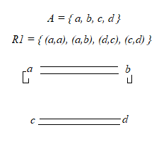
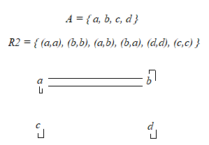
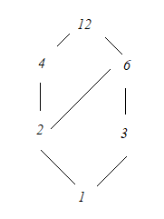

# 1. Sean los conjuntos $A = \{ 1, 0, -1 \}$ y $B = \{ 4, 3, 2, 1 \}$, decide si las siguientes corresponden a relaciones de A en B. Justifica.

## a. $R= \{ (1,1), (0,2)\}$

Sí, ya que sus elementos corresponden a un subconjunto de $A \times B$:

* $(1,1): 1 \in A;1 \in B$

* $(0,2): 0 \in A;2 \in B$

## b. $R = \{ (-1,1), (1,-1)\}$

No, ya que no existe en $A \times B$ el subconjunto $(1,-1)$:

* $(-1,1) : -1 \in A; 1 \in B$

* $(1,-1) : 1 \in A; -1 \notin B \to (1,-1) \not\subset A \times B$

## c. $R = \{(-1,1), (-1,2), (-1,3)\}$

Sí, ya que sus elementos corresponden a un subconjunto de $A \times B$:

* $(-1,1): -1 \in A; 1 \in B$

* $(-1,2): -1 \in A; 2 \in )$

* $(-1,3): -1 \in A; 3 \in B$

## d. $R = \{(4,1)\}$

No, ya que no existe en $A \times B$ el subconjunto $(4,1)$:

* $(4,1) : 4 \notin A; 1 \in B \to (4,1) \not\subset A \times B$

## e. $R = \{ \empty \}$

Sí, ya que aunque $R$ no tenga elementos igualmente puede obtenerse como un subconjunto de $A \times B$.

# 2. Sea $A = \{ -3, -2, -1, 0, 1, 2, 3\}$, $B = Z$ la una relación de $A$ con $B$ definida como: $xRy$ si y sólo si $y$ es el cuadrado de $x$.

## Escribir $R$ por extensión.

$R = \{(-3,9), (-2,4), (-1,1), (0,0), (1,1), (2,4), (3,9)\}$

## Definir $R^{-1}$ por comprensión y por extensión.

* **Comprensión:** $R^{-1} = \{ (y,x): x \in A; y \in B; x^2=y \}$

* **Extensión:** $R^{-1} = \{ (9,-3), (4,-2), (1,-1), (0,0), (1,1), (4,2), (9,3) \}$

# 3. Sean los conjuntos $A = \{a,b,c,d,e\}, V = \{vocales\}, B = \{1,2,3\}$. Decidir si las siguientes corresponden a relaciones válidas. Justificar:

## a. $R = \{(a,a,a);(a,b,c);(b,c,d)\}$ en $A\times A \times A$

Sí, ya que es un subconjunto del producto cartesiano:

* $\{ (a,a,a) \}: a \in A$
* $\{(a,b,c)\}: a \in A; b \in A; c \in A$
* $\{(b,c,d)\}: b \in A; c \in A; d \in A$

## b. $R=\{(a,a,a);(c,e,2);(a,b,1)\}$ en $A \times V \times B$

No, ya que el primer elemento no forma parte de ningún subconjunto posible para $A \times V \times B$:

* $\{ (a,a,a) \} : a \in A; a \in V; a \notin B \to R \not\subset A \times V \times B$

## c. $R = \{ (a,b,1); (e,c,2); (i,j,3)\}$ en $V \times A \times B$

No, ya que contiene elementos que no pertenecen a $V \times A \times B$, por lo tanto es un subconjunto inválido:

* $\{(a,b,1)\}: a \in V; b \in A; 1 \in B$

* $\{ (e,c,2) \}: e \in V; c \in A; 2 \in B$

* $\{ (i,j,3) \}: i \in V; j \notin A, 3 \in B \to R \not\subset V\times A \times B$

## d. $R = \{ (a,z,3); (b,i,2); (c,x,1) \}$ en $A \times V \times B$

No, ya que contienen elementos que no pertenecen a $A \times V \times B$, por lo que es un subconjunto inválido:

* $\{ (a,z,3)\}: a \in A; z \notin V; 3 \in B \to R \not\subset A \times V \times B$

# 4. Sea $A = \{ 1,2,3 \}$ y la relación $R$ en $A \times A \times A$ definida como: $(x,y,z) \in R$ si y sólo si $x < y; y < z$, siendo $<$ el "menor" usual entre números reales, escribir $R$ por extensión.

$R = \{ (1,2,3) \}$

# 5. Para cada una de las siguientes relaciones: dar tres pares que pertenezcan y tres pares que no. Indicar si son reflexivas, simétricas, antisimétricas y/o transitivas.

## a. En el conjunto de los números reales

### $xRy$ si y sólo si $x \ge 4; y \ge 5$

$(x,y) \in R$:
* $(4,5)$
* $(5,5)$
* $(6,5)$

$(x,y) \notin R$:
* $(0,0)$
* $(1,2)$
* $(4,4)$

$R$ no es reflexiva, ya que no se cumple $xRx$ para todos los elementos $x\in \real$.
* $0 \in \real; (0,0) \notin R$

$R$ no es simétrica, ya que que $(x,y)$ no implica $(y,x)$ para todos los elementos de la relación.
* $(4,5) \in R; (5,4) \notin R$

$R$ no es antisimétrica, ya que  en los casos que $(x,y) \to (y,x)$ no siempre se cumple que $x = y$
* $(8,9) \in R; (9,8) \in R; 8 \ne 9$

$R$ es transitiva, ya que $xRy$ y $yRz$ implican la existencia de $xRz$.
* $xRy = (4,5) \quad yRz=(5,6) \quad xRz = (4,6) \in R$

### $xRy$ si y sólo si $y \le x \le y+3$

$(x,y) \in R$
* $(1,1) = 1 \le 1 \le 4$
* $(2,1) = 1 \le 2 \le 4$
* $(2,2) = 2 \le 2 \le 5$

$(x,y) \notin R$
* $(1,2)$
* $(1,3)$
* $(1,4)$

$R$ es reflexiva, ya que se cumple $xRx$ para todos los elementos de $\real$:
* $xRx = (a,a) = a \le a \le a+3; a \in \real$

$R$ no es simétrica, ya que que $(x,y)$ no implica $(y,x)$ para todos los elementos de la relación.
* $(2,1) = 1 \le 2 \le 4; (2,1) \in R$
* $(1,2) = 2 \le 1 \le 5; (1,2) \notin R$ *// la condición de $R$ no se cumple*

$R$ es antisimétrica, ya que cuando se cumple $(x,y) \to (y,x)$ es porque se cumple que $x = y$

* $R$ no es simétrica, por lo que $(x,y) \not\to (y,x)$ para todos los pares $(x,y)$.
* $R$ es reflexiva, por lo que el par $(x,x) \in R$
    * $(a,a) = a \le a \le a+3; a \in \real$
    * Esto implica que $(x,y) \to (y,x)$ sí se cumple cuando $x=y$.

$R$ no es transitiva, ya que $xRy$ y $yRz$ no garantizan la existencia de $xRz$.
* $xRy = (5,4): 4 \le 5 \le 7$
* $yRz=(4,1): 1 \le 4 \le 4$
* $xRz: (5,1): 1 \le 5 \le 4; (5,1) \notin R$ *// la condición de $R$ no se cumple*

## b. Sean $A=\{ 1,2,3,4 \}$ y $P(A)$ el conjunto de partes de $A$

### En $P(A)$, $XRY$ si y sólo si $X \cap Y = \empty$

$(X,Y) \in X \cup Y = \empty$
* $\{ \{1\}, \{ 2,3,4 \} \}$
* $\{ \{2\}, \{ 1,3,4 \} \}$
* $\{ \{3\}, \{ 1,2,4 \} \}$

$(X,Y) \notin X \cup Y = \empty$
* $\{ \{1\}, \{ 1,2\} \}$
* $\{ \{2\}, \{ 2,4\} \}$
* $\{ \{3\}, \{ 3,4\} \}$

$R$ no es reflexiva, ya que no se cumple $XRX$ para ninguna partición de $P(A)$.
* $XRX =( \{ {a} , {b} \}, \{ {a} , {b} \}); \{ a,b\} \in P(A): X \cap X = \{ a,b\}$ *// siendo $a,b$ valores cualquiera $\in P(A)$*
* $X \cap X = \empty$ no se cumple para ninguna partición de $A$, a excepción del conjunto vacío.

$R$ es simétrica, ya que $XRY$ implica $YRX$ para todas las particiones de $A$.
* $XRY =  (\{ 1,2\}, \{ 3,4\}) : X \cap Y = \empty$
* $YRX =  (\{ 3,4\}, \{ 1,2\}) : Y \cap X = \empty$
* La intersección de conjuntos es una operación conmutativa, por lo que $X \cap Y = Y \cap X$. Esto quiere decir que, cuando la intersección es vacía, lo será independientemente del orden de la relación.

$R$ no es antisimétrica, ya que se cumple $XRY \to YRX$ incluso cuando $X \ne Y$.
* *// esto es lo mismo que el ejemplo anterior con $\{1,2\}, \{3,4\}$.*

$R$ no es transitiva, ya que $XRY$ y $YRZ$ no implican $XRZ$.
* $XRY = (\{ 1\}, \{ 2,3\}) \in R$
* $YRZ = (\{ 2,3\}, \{ 1,4\}) \in R$
* $XRZ = (\{1 \}, \{1,4\}) \notin R: X \cap Z = \{ 1\}$

### En $P(A)$, $XRY$ si y sólo si $X \subset Y$

$(X,Y) \in X \subset Y$
* $\{ \{ 1\}, \{ 1,2\} \}$
* $\{ \{ 1\}, \{ 1,2,3\} \}$
* $\{ \{ 1\}, \{ 1,2,3,4\} \}$

$(X,Y) \notin X \subset Y$
* $\{ \{ 1\}, \{ 1\} \}$
* $\{ \{ 1\}, \{ 2,3\} \}$
* $\{ \{ 1\}, \{ 3,4\} \}$

$R$ no es reflexiva, ya que no se cumple $XRX$ para ninguna partición de $P(A)$.
* La operación $\subset$ es estricta, por lo que no permite igualdad entre conjuntos.
* $XRX$ implica siempre que $X = X$, por lo cual nunca cumplirá la condición de $R$.

$R$ no es simétrica, ya que $XRY$ no implica $YRX$ para ninguna partición de $P(A)$.
* $XRY=\{ \{ 1\}, \{ 1,2\} \}: X \subset Y$
* $YRX = \{ \{ 1,2\}, \{ 1\} \}: Y \not\subset X$
* La operación $\subset$ implica que $X$ está contenido en $Y$, por lo tanto si se cumple $X \subset Y$ es imposible que, al mismo tiempo $Y$ sea un subconjunto de $X$.

$R$ no es antisimétrica, ya que $XRY \to YRX$ no se cumple aún cuando $X=Y$.

* $R$ no es reflexiva para ningún par $X,Y$, ya que la operación $\subset$ es estricta y no acepta igualdades.
* $R$ no es simétrica, ya que no se cumple $XRY \to YRX$ para ningún valor de $X,Y$.
* Por lo tanto, tampoco se cumple cuando $X=Y$. Esto no pasaría si en vez de $\subset$ fuese $\subseteq$.

$R$ es transitiva, ya que $XRY$ y $YRZ$ implican $XRZ$.

* $XRY = \{ \{ 1\}, \{ 1,2\} \} : X \subset Y$
* $YRZ = \{ \{ 1,2 \}, \{ 1,2,3 \} \}: Y \subset Z$
* $XRZ = \{ \{ 1\}, \{ 1,2,3 \} \}: X \subset Z$
* La operación $\subset$ en conjuntos en transitiva, indicando que el subconjunto de un subconjunto también pertenece a un conjunto original (👈 trabalenguas). Por lo tanto, la relación $R$ definida por esta operación también será transitiva.

# 6. Determinar si las siguientes relaciones definidas en $A = \{ a, b, c, d\}$ son reflexivas, simétricas, antisimétricas y transitivas:

## a. $R_0 = \empty$

* **Reflexiva:** no, ya que existen valores $x \in A$ tales que $xRx$ no pertenecen a $R_0$.
    * $(a,a): a \in A; aRa \notin R_0$
* **Simétrica:** sí, ya que $xR_0y$ implica $yR_0x$.
    * Dados $x,y \in A$:
        * $xRy \notin R_0$
        * $yRx \notin R_0$
        * $xRy \to yRx = F \to F = V$
* **Antisimétrica:** sí, ya que como el conjunto vacío no tiene elementos, siempre se cumple $x=y$.
* **Transitiva:** sí, ya que $xR_0y$ e $yR_0z$ implican $xR_0z$.
    * Dados $x,y,z \in$:
        * $xRy \notin R_0$
        * $yRz \notin R_0$
        * $xRz \notin R_0$
        * $xR_0y \land yR_0z \to xR_0z = (F \land F) \to F = V$

## b. $R_1 = \{ (a,a); (a,b); (d,c); (c,d) \}$

* **Reflexiva:** no, ya que no se cumple $xRx$ para todo $x \in A$.
    * $(a,a) \in R_1$
    * $(b,b) \notin R_1$
    * $(c,c) \notin R_1$
    * $(d,d) \notin R_1$
* **Simétrica:** no, ya que $xRy$ no siempre implica $yRx$ para todo $(x,y) \in R_1$.
    * $(a,a) \to (a,a) = V \to V = V$
    * $(a,b) \to (b,a) = V \to F = F$
    * $(d,c) \to (c,d) = V \to V = V$
* **Antisimétrica:** no, ya que $xRy \to yRx$ se cumple aunque $x \neq y$.
    * $(d,c) \to (c,d) = V; c \neq d$
* **Transitiva:** no, ya que $xRy$ e $yRz$ no implican $xRz$ para todo $x,y,z \in R_1$.
    * $xRy = (d,c)$
    * $yRz = (c,d)$
    * $xRz = (d,d)$
    * $xRy \land yRz \to xRz = V \land V \to F = F$

## c. $R_2 = \{ (a,a); (b,b); (a,b); (b,a); (d,d); (c,c) \}$

* **Reflexiva:** sí, ya que se cumple $xRx$ para todo $x \in A$.
    * $(a,a) \in R_2$
    * $(b,b) \in R_2$
    * $(c,c) \in R_2$
    * $(d,d) \in R_2$
* **Simétrica:** sí, ya que todo $xRy$ implica $yRx$ para todo $x,y \in A$.
    * $aR_2a \to aR_2a = V$
    * $bR_2b \to bR_2b = V$
    * $aR_2b \to bR_2a = V$
    * $dR_2d \to dR_2d = V$
    * $cR_2c \to cR_2c = V$
* **Antisimétrica:** no, ya que existen implicaciones $xRy \to yRx$ en las que $x \neq y$.
    * $(a,b) \to (b,a); b \neq a$
* **Transitiva:** sí, ya que $xRy, yRz$ implican $xRz$ para todo $x,y,z \in A$.
    * $xRy: (a,b)$
    * $yRz: (b,a)$
    * $xRz: (a,a)$
    * $xRy \land yRz \to xRz = V \land V \to V = V$

## c. $R_3 = \{ (a,a); (a,b); (b,a); (b,c); (c,b); (b,b) \}$

* **Reflexiva:** no, ya que no se cumple $xRx$ para todo $x \in A$.
    * $(a,a) \in R_3$
    * $(b,b) \in R_3$
    * $(c,c) \notin R_3$
    * $(d,d) \notin R_3$
* **Simétrica:** sí, ya que $xR_3y$ implica lógicamente a $yR_3x$ para todo $x,y \in A$.
    * $aR_3a \to aR_3a = V$
    * $aR_3b \to bR_3a = V$
    * $bR_3c \to cR_3a = V$
    * $bR_3b \to bR_3b = V$
    * $cR_3c \to cR_3c = F \to F = V$
* **Antisimétrica:** no, ya que existen implicaciones $xR_3y \to yR_3x$ tales que $x \neq y$.
    * $aR_3b \to bR_3a = V; a \neq b$
* **Transitiva:** no, ya que existen relaciones $xRy, yRz$ que no implican $xRz$.
    * $xRy: aR_3b$
    * $yRz: bR_3c$
    * $xRz: aR_3c$
    * $aR_3b \land bR_3c \to aR_3c = V \land V \to F = F$

## d. $R_4 = A \times A$

*// no lo voy a hacer pero creo que es reflexiva, simétrica, transitiva y no es antisimétrica*

# 7. Escribir la matriz y los digrafos asociados a las relaciones anteriores

*// no voy a hacer todos*

## a. $R_1$

| - | a | b | c | d |
| - | - | - | - | - |
| a | 1 | 0 | 0 | 0 |
| b | 1 | 0 | 0 | 0 |
| c | 0 | 0 | 0 | 1 |
| d | 0 | 0 | 1 | 0 |

## b. $R_2$

| - | a | b | c | d |
| - | - | - | - | - |
| a | 1 | 1 | 0 | 0 |
| b | 1 | 1 | 0 | 0 |
| c | 0 | 0 | 1 | 0 |
| d | 0 | 0 | 0 | 1 |

# 8. Sea $A = \{ a,b,c,d \}$

## a. Dar un ejemplo de una relación $R$ no reflexiva en $A$

$R_a = \{ (a,b), (b,c), (b,a) \}$

## b. Dar un ejemplo de una relación $R$ simétrica en $A$

$R_b = \{ (a,b), (b,a), (b,b), (a,a) \}$

## c. Dar un ejemplo de una relación $R$ no transitiva en $A$

$R_c = \{ (a,b), (b,c) \}$

## d. Dar un ejemplo de una relación $R$ no simétrica en $A$

$R_d = \{ (a,b), (b,b) \}$

## e. Dar un ejemplo de una relación $R$ antisimétrica en $A$

$R_e = \{ (a,a), (a,b), (b,c) \}$

# 9. Demostrar que si $R$ es simétrica y transitiva, y se cumple $aRb$ para ciertos $a,b$, entonces $aRa$ y $bRb$.

* Si $R$ es simétrica, entonces toda relación $xRy$ implica que también existe $yRx \in R$.
* Si $R$ es transitiva, entonces las relaciones $xRy, yRz$ implican $xRz$.
* Como $R$ es simétrica, si se cumple $aRb$ también se cumple $bRa$.
* Como se cumplen $aRb$ y $bRa$, por transitividad se puede demostrar que:
    * $aRb \land bRa \to aRa$
    * $bRa \land aRb \to bRb$

# 10. Sea $A$ un conjunto arbitrario, y sea $R = \triangle_A$, analizar qué propiedades tiene $R$.

*// la diagonal de una matriz está formada por aquellos elementos en las celdas $[i][i]$, supongo que se refiere a eso. En el caso de las relaciones, los elementos en esas celdas son iguales.*

* $R$ es reflexiva, ya que está formada por los elementos tales que $xRx$.
* $R$ es simétrica, ya que toda relación $xRy$ implica también $yRx$.
    * Como los elementos de $R$ son iguales, podría decirse que sus relaciones se implican a sí mismas.
* $R$ es antisimétrica, ya que todas sus relaciones $xRy \to yRx$ implican $x = y$.
    * Nuevamente, como sus elementos están definidos por los valores $[i][i]$ de la matriz, los valores son iguales.
* $R$ también es transitiva, ya que las relaciones $xRy, yRz$ implican $xRz$.
    * Todas las relaciones de $R$ son de tipo $xRx$, por lo que siempre se cumple $xRx \land xRx \to xRx$.

# 11. Proponer una relación en el conjunto de los números naturales. Mostrar qué propiedades tiene.

$R : \{(x,y) : x \in N; y \in N; x^2=y \}$

* No es reflexiva, ya que no se cumple $xRx$ para todos los valores.
    * $x^2 > x$ para todo $x \gt 1$, por lo tanto $x \neq x^2$
* No es simétrica, ya que $xRy$ no implica $yRx$
    * Nuevamente, para todo $x \gt 1$ es imposible que el cuadrado de $x^2$ sea igual a $x$
* Es antisimétrica, ya que $xRy \to yRx$ sólo se cumple bajo $x = y$
    * El único caso que se cumple la simetría es con $x=1$, bajo la cual $y=x^2=1$, por lo que $x=y$
    * Si consideramos al 0 como un número natural le pasa lo mismo que al 1
* No es transitiva, ya que $xRy, yRz$ no implican $xRz$.
    * $xRy$ implica que $x^2 = y$
    * $yRz$ implica que $y^2 = z$
    * Por lo tanto, $z = x^4$, entonces no se cumple $xRz$

# 12. Proponer una relación en el conjunto de los alumnos de Informática. Mostrar qué propiedades tiene.

*// no lo voy a hacer todo pero quiero pensar un conjunto que cumpla con todas las propiedades*

$R = \{ (x,y): x \in informática; y \in informática; x.legajo = y.legajo\}$

Considerando al legajo de un alumno como una clave unívoca.

* Es reflexiva, ya que un alumno tiene su propio legajo, por lo tanto se cumple $xRx$.
* Es simétrica, ya que todas las relaciones son del tipo $xRx$, por lo que se implican a sí mismas.
* Es antisimétrica, ya que en todas las relaciones simétricas se da que $x = y$.
* Es transitiva, ya que $xRy, yRz$ implican a $xRz$, porque nuevamente todas las relaciones se implican a sí mismas.

# 13. Dada una relación binaria $R$ sobre un conjunto $A$, se define la relación "complemento de $R$" ($\overline R$) como: $a\overline Rb$ si y sólo si $a$ no está rleacionada con $b$ por $R$.

## a. Dar un ejemplo de una relación $R$ y su complemento

$A= \{ 1, 2, 3, 4 \}$

$R = \{ (1,1), (1,4), (2,3) \}$

$\overline R = \{ (1,2), (1,3), (2,2), (2,4), (3,4), (4,4) \}$

## b. Probar que si $R \subset S$ entonces $\overline S \subset \overline R$

$R = \{ (1,1), (1,4), (2,3) \}$

$S = \{ (1,1), (1,4), (2,3), (4,4) \}$

$\overline R = \{ (1,2), (1,3), (2,2), (2,4), (3,4), (4,4) \}$

$\overline S = \{ (1,2), (1,3), (2,2), (2,4), (3,4) \}$

$R \subset S \to \overline S \subset \overline R$

* Si $R \subset S$, entonces se sabe que $S$ tiene más elementos relacionados que $R$.
* Por contraposición, existirán más elementos no relacionados por $R$ que por $S$.
* Por lo tanto, $\overline S$ tiene menos elementos no relacionados, ya que $S$ tiene más relaciones que $R$. Esto implica que hay más elementos en $\overline R$.
* Como $R$ es un subconjunto de $S$, los elementos de $S - R$ no estarán en $\overline S$ pero sí en $\overline R$, mientras que ambos compartirán $S - R$.
* Debido a esto, $\overline S$ es un subconjunto de $\overline R$.

# 13. Dada una relación binaria $R$ sobre $A$, probar que:

## a. $R$ es reflexiva si y sólo si $R^{-1}$ también lo es

* $R$ sólo es reflexiva si $xRx$ para todo $x \in A$.
* $R^{-1}$ está definida como $\{(y,x): (x,y) \in R \}$
* Por lo tanto, $xRx$ y $xR^{-1}x$ son lo mismo.
* Entonces si $R^{-1}$ no es reflexiva, $R$ tampoco (y viceversa).

## b. $R$ es simétrica si y sólo si $R^{-1} = R$

* $R$ sólo es simétrica si $xRy \to yRx$.
* Esta definición se asemeja a la de $R^{-1}$, tal que contiene los elementos $(x,y)$ pero invertidos.
* Si $R$ tiene los pares $(x,y)$ e $(y,x)$ a la vez (es decir, es simétrica), entonces $R^{-1}$ también los tiene.
* Por lo tanto, cuando $R$ es simétrica se cumple que $R=R^{-1}$.

## c. $R$ es simétrica si y sólo si $R^{-1}$ y $\overline R$ también lo son.

* A partir del inciso anterior sabemos que $R$ es simétrica sólo si $R^{-1} = R$, por lo que cuando ambas son iguales entonces también son simétricas.

*// la de $\overline R$ ni idea je*

# 15. Se dice que una relación $R$ sobre un conjunto $A$ es asimétrica si cada vez que $a$ está relacionada con $b$, no se da que $b$ esté relacionada con $a$. Dar un ejemplo de una relación asimétrica.

$A = \{ 1, 2, 3, 4, 5\}$

$R= \{ (1,2), (2,3), (3,4), (4,5), (5,1) \}$

# 16. Probar que dada una relación $R$ sobre un conjunto $A$, $R$ es asimétrica si y sólo si $R \cap R^{-1} = \empty$

Como ya definimos antes, $R$ es simétrica cuando $R = R^{-1}$.

Esto implica que $R \cap R^{-1} = R \cup R^{-1}$; es decir, comparten todos sus elementos.

Una relación asimétrica implica que si $(x,y) \in R \to (y,x) \notin R$. Por otro lado, $R^{-1}$ está formado por todos los pares $(y,x)$ tales que $(x,y) \in R$.

Como $R$ está formada por pares $(x,y)$ y $R^{-1}$ por sus respectivos pares $(y,x)$, si $R$ es asimétrica entonces no tiene ningún par $(x,y)$ y a la vez el $(y,x)$.

Por lo tanto, la intersección entre $R$ y $R^{-1}$ es vacía cuando $R$ es asimétrica.

## 17. Sean $R$ y $S$ dos relaciones en $A$, probar que:

## a. Si $R \subset S$, entonces $R^{-1} \subset S^{-1}$

* $R^{-1} = ((y,x) : (x,y) \in R)$
* $R^{-1}$ tiene los mismos pares que $R$, pero cambiando el orden de $x$ e $y$.
* Como $R \subset S$, $R^{-1}$ tiene un subconjunto de elementos tales que $(y,x) : (x,y) \in S$
* Y esa es la definición de $S^{-1}$.

## 18. Establecer las propiedades de las siguientes relaciones en $H$, el conjunto de los seres humanos:

## a. Sea $R$ la relación en $H$ definida por: $xRy$ si y sólo si $x$ es hermano de $y$

* **Reflexiva:** podría ser un debate filosófico: si definimos a un hermano como una persona nacida de nuestros mismos padres, entonces una persona sí es hermana de sí misma y se cumple $xRx$ para todo $x \in H$. Pero yo creo que no somos hermanos de nosotros mismos.
* **Simétrica:** sí, ya que si $x,y \in H$ son hermanos, se cumple que $x$ es hermano de $y$ a la vez que $y$ es hermano de $x$, por lo tanto $xRy \to yRx$.
* **Antisimétrica:** no, ya que existen relaciones $xRy \to yRx$ tales que $x \neq y$.
* **Transitiva:** sí, ya que el hermano $z$ de mi hermano $y$ también es mi hermano, tales que $xRy \land yRz \to xRz$.

## b. Sea $R$ la relación $H$ definida por $xRy$ si y sólo si $x$ es hijo de $y$.

* **Reflexiva:** no, ya que una persona no puede ser hija de sí misma, por lo tanto no se cumple $xRx$ para ningún $x \in H$.
* **Simétrica:** no, ya que una persona no puede ser padre de sus hijos, por lo tanto $xRy$ nunca implica $yRx$.
* **Antisimétrica:** no, ya que la simetría no se cumple aún cuando $x = y$; de hecho $x\ne y$ para todos los pares de $H$.
* **Transitiva:** no, ya que los hijos de una persona $x$ no son los hijos de su padre $y$, sino que son sus nietos $z$.

## c. Sea $R$ la relación en $H$ definida por $xRy$ si y sólo si $x$ es descendiente de $y$.

* **Reflexiva:** no, ya que una persona no es descendiente de sí misma.
* **Simétrica:** no, ya que una persona $x$ siendo descendiente de $y$ nunca que implica que $y$ también descienda de $x$.
* **Antisimétrica:** no, ya que $xRy \to yRx$ no se cumple aún cuando $x=y$; de hecho $x \neq y$ para todos los pares $\in H$.
* **Transitiva:** sí, ya que una persona $x$ descendiente de otra $y$ también tiene sus mismos descendientes $z$, de manera que $xRy, yRz$ implican $xRz$.

# 19. Establecer las propiedades de las siguientes relaciones:

## a. Sea $N$ el conjunto de los naturales, sea $\le$ la relación dada por $x \le y$ si y sólo si $x$ es menor o igual a $y$.

## b. Sea $N$ el conjunto de los naturales, sea $|$ la relación dada por $x|y$ si y sólo si $x$ divide a $y$.

## c. La anterior pero con el conjunto de los enteros

# 20. Dado un conjunto de números reales $A$, probar que la relación sobre $A \times A$ dada por $(a,b)R(c,d)$ si y sólo si $a \le c$ y $b \le d$ es un orden. ¿Es total?

Una relación es un orden si es reflexiva, transitiva y antisimétrica.

* $R$ es reflexiva, ya que se cumple $xRx$
    * $(a,b)R(a,b): a \le a; b \le b \to (a,b) \in R$
* $R$ es transitiva, ya que $xRy \land yRz$ implican $xRz$
    * $xRy = (a,b)R(c,d); a \le c; b \le d$
    * $yRz = (c,d)R(e,f); c \le e; d \le f$
    * $xRz = (a,b)R(e,f); a \le c \le e; b \le d \le f$
* Es antisimétrica, ya que $xRy \to yRx$ sólo cuando $x=y$
    * Con $x \ne y$:
        * $(a,b)R(c,d) = a \le c; b \le d$
        * $(c,d)R(a,b) = c \le a; d \le d$
        * Son contradictorias, por lo que si $xRy \in R; yRx \notin R$ y viceversa.
    * Con $x = y$:
        * $(a,b)R(a,b) = a \le a; b \le b$
        * Cuando $x=y$, $xRy \to yRx$, por lo que $R$ es antisimétrica.

Por lo tanto, $R$ es un orden. Al ser una operación válida para todos los números reales, también es un orden total.

# 21. Analizar qué tipo de orden es usual en el conjunto de los números reales. ¿Qué pasa con los números complejos? ¿Están ordenados?

Los números reales se ordenan mediante $\le$; es decir, si los objetos son menores o iguales entre sí. Este es un orden total, ya que:
* Un elemento es menor o igual a sí mismo.
* $x \le y$ implica $y \le x$ sólo cuando $x=y$.
* Si $x \le y$ e $y \le z$, entonces $x \le z$.

Los números ordenados no siguen el mismo orden que los números reales. Una manera de ordenarlos podría ser dividiendo su parte real e imaginaria.

# 22. Probar que el orden lexicográfico es un orden total

# 23. Sea $S = \{ a,b,c \}$ y sea $A = P(S)$ el conjunto de partes de $S$, mostrar que $A$ está parcialmente ordenado por la operación $\subset$. Hallar el diagrama de Hasse.

$A = P(S) = \{ \empty, \{ a \}, \{ b \}, \{ c \}, \{ a, b\}, \{ a, c\}, \{ b,c \}, \{ a, b, c\} \}$

$R = \subset$

* $R$ **no** es reflexiva, ya que no se cumple $xRx$ para todo $x \in A$. La operación $\subset$ es estricta, por lo que no incluye la igualdad de conjuntos.

Por lo tanto, $\subset$ no es un orden de $A$.

# 24. Sea $D_{12} = \{ 1, 2, 3, 4, 6, 12 \} (conjunto de divisores de 12), hallar el diagrama de Hasse de $D_{12}$ con la relación "divide".

# 25. Describa las parejas ordenadas por las relaciones de cada uno de los siguientes diagramas de Hasse. Determinar, si existen, los elementos máximos, mínimos, cotas inferiores y superiores.

## a.

* $a \ge b, c, d, e, f$
* $b,c,d \ge g$
* $d \ge h$
* $d,e,f \ge i$
* $g, h, i \ge j$

**Máximo:** $a$.

**Mínimo:** $j$.

$a$ es la cota superior para todos los subconjuntos, y $j$ es la cota inferior.

## b.

* $1 \ge a,b,c,d$
* $a,b,c,d \ge 0$

**Máximo:** $1$.

**Mínimo:** $0$.

$1$ es la cota superior para todos los subconjuntos, y $0$ es la cota inferior.

# 26. Sea $R$ una relación de equivalencia en un conjunto no vacío $A$, y sean $a.b \in A$, entonces $[a] = [b]$ si y sólo si $aRb$.

*// esto es una afirmación o una pregunta? no quiero resolverlo a la 1AM*

# 27. Determinar si cada una de las siguientes colecciones de conjuntos es una partición para el conjunto $A= \{ 1,2,3,4,5,6,7,8 \}$

## a. $\{ \{ 4,5,6\}; \{ 1,8\}; \{ 2,3,7\} \}$

Sí, ya que:
* No hay partes vacías.
* Los elementos aparecen en una y sólo una parte.
* La unión de todas las partes es igual a $A$.

## b. $\{ \{ 4,5 \}; \{ 1,3,4 \}; \{ 6,8 \}; \{ 2,7 \} \}$

No, ya que no se cumplen todas las propiedades de las particiones.
* El elemento $4$ se encuentra repetido en las partes $\{ 4, 5 \}; \{ 1,3,4 \}$, por lo que su intersección no es vacía.

## c. \{ \{1,3,4 \} ; \{ 2,6\}; \{ 5,8\} }$

No, ya que no se cumplen todas las propiedades de las particiones.
* El elemento $7$ no se encuentra en ninguna parte, por lo que la unión entre ellas no será igual a $A$.

# 28. Considerando el conjunto $A$ de los alumnos que cursan Matemática 4, indicar cuáles de las siguientes son particiones de $A$:

## a. $P = \{$ {*alumnos que aprobaron CADP*}, {*alumnos que aprobaron OC*}, {*alumnos que no aprobaron ISO ni Redes*}$\}$

No es una partición, ya que podría haber alumnos de Matemática 4 que hayan aprobado CADP y OC, además de no aprobar ISO ni Redes. Por lo tanto, las particiones compartirían elementos.

## b. $P = \{$ {*alumnos cursando Programación Distribuida*}, {*alumnos cursando Sistemas y Organizaciones*}, {*alumnos cursando Lógica e Inteligencia Artificial*}$\}$

No, ya que hay varios problemas:
* Podría haber alumnos cursando las tres materias a la vez, por lo que habría elementos compartidos entre las partes.
* Podría haber alumnos que no estén cursando ninguna de esas materias, por lo que la unión de las particiones no sería igual a todos los alumnos de Matemática.
* Podría darse que ningún alumno de Matemática esté cursando una de esas materias en particular, por lo que sería una parte vacía.

# 29. Sean $A=\{ 1,2,3,4\}$ y $R=\{ (1,1); (1,2); (2,1); (2,2); (3,3); (3,4); (4,3); (4,4)\}$, mostrar que $R$ es una relación de equivalencia y hallar las clases de equivalencia.

Una relación $R$ es equivalente si es reflexiva, simétrica y transitiva.

* $R$ es reflexiva, ya que para cada $x \in A$ se cumple $xRx$.
    * $(1,1) \in R$
    * $(2,2) \in R$
    * $(3,3) \in R$
    * $(4,4) \in R$
* $R$ es simétrica, ya que $xRy$ implica lógicamente a $yRx$.
    * Cuando $xRy \in R$, existe $yRx \in R$ tal que $xRy \to yRx = V \to V = V$.
    * Cuando $xRy \notin R$, también se cumple $yRx \notin R$, tal que $xRy \to yRx = F \to F = V$
* $R$ es transitiva, ya que dadas $xRy, yRz \in R$ se implica $xRz$.
    * $(1,2) \land (2,1) \to (1,1) = V$
    * $(3,4) \land (4,3) \to (3,3) = V$
    * etc.

## Clases de equivalencia

* $R(1) = \{ 1, 2 \}$
* $R(2) = \{ 1, 2 \}$
* $R(3) = \{ 3,4 \}$
* $R(4) = \{ 3,4 \}$

## ¿Cuál es la partición que induce $R$ sobre $A$?

$R$ genera la partición $P(A) = \{ \{ 1,2 \}; \{ 3,4 \} \}$
* La intersección entre partes es vacía, por lo que no comparten elementos.
* No hay partes vacías.
* La unión de las partes es igual a $A$, por lo que no hay elementos sin asignar.

# 30. Dados el conjunto $A = \{ a,b,c,d,e \}$ y una partición $P= \{ \{ a,c \}; \{ b\}; \{ d,e\} \}$, escribir por extensión la relación de equivalencia sobre $A$ inducida por $P$.

$P$ está formado por las clases de equivalencia:
* $R(a) = \{ a, c \}$
* $R(b) = \{ b \}$
* $R(c) = \{ a, c \}$
* $R(d) = \{ d, e \}$
* $R(e) = \{ d, e\}$

De tal manera que $R$ se define como:

$R = \{ (a,a); (a,c); (b,b); (c,a); (c,c); (d,d); (d,e); (e,d); (e,e) \}$

# 31. Sean $A = \{ 1, 2, 3, 4, 5, 6 \}$ y $R= \{ (1,1); (1,2); (2,1); (2,2); (3,3); (4,4); (4,5); (5,4); (5,5); (6,6) \}$, mostrar que $R$ es una relación de equivalencia y determinar las clases de equivalencia.

$R$ es una relación de equivalencia ya que:
* Es reflexiva, ya que $xRx$ para todo $x \in A$:
    * $(1,1) \in R$
    * $(2,2) \in R$
    * $(3,3) \in R$
    * $(4,4) \in R$
    * $(5,5) \in R$
    * $(5,6) \in R$
* Es simétrica, ya que $xRy$ implica $yRx$ para todo $x,y \in A$.
    * $(1,1) \to (1,1)$
    * $(1,2) \to (2,1)$
    * $(2,2) \to (2,2)$
    * $(3,3) \to (3,3)$
    * $(4,4) \to (4,4)$
    * $(4,5) \to (5,4)$
    * $(5,5) \to (5,5)$
    * $(6,6) \to (6,6)$
* Es transitiva, ya que $xRy, yRz$ implican lógicamente a $xRz$.
    * $(1,1) \land (1,1) \to (1,1)$
    * $(1,2) \land (2,1) \to (2,2)$
    * $(4,5) \land (5,4) \to (4,4)$
    * etc.

Clases de equivalencia:
* $R(1) = \{ 1, 2 \}$
* $R(2) = \{ 1, 2 \}$
* $R(3) = \{ 3 \}$
* $R(4) = \{ 4, 5 \}$
* $R(5) = \{ 4, 5 \}$
* $R(6) = \{ 6 \}$

## ¿Qué partición de $A$ induce $R$?

$R$ induce la partición $P(A) = \{ \{ 1, 2 \}, \{ 3 \}, \{ 4, 5 \}, \{6 \} \}$

# 32. Sea $\sim$ una relación definida en $Z \times (Z0)$ dada por: $(a,b) \sim (c,d)$ si y sólo si $ad = bc$:

## a. Probar que es de equivalencia.

* $\sim$ es reflexiva, ya que para todo par de números enteros se cumple $ad = ad$, por lo tanto $xRx$ es válida para todo $x \in $Z \times (Z0)$
* $\sim$ es simétrica, ya que se cumple $(ad = bc) = (bd = ad)$, por lo tanto $xRy$ implica $yRx$.
* $\sim$ es transitiva, ya que si se cumplen $ad=bc, bc=xy$ para los enteros $(a,d,b,c,x,y)$, entonces también se implica la igualdad $ad=xy$.

Por lo tanto, $\sim$ es una relación de equivalencia.

## b. Hallar la clase de equivalencia del elemento $(1,4)$

$1 \times 4 = 4$

$R((1,4)) = \{ \{ 1,4\}, \{ 2,2\} \}$

## c. Mostrar que puede identificarse cada clase de equivalencia con un número racional

*// no entendí*

# 33. Hallar las clases de equivalencia módulo 3 y 5 de los números 387, 25 y 649.

Las clases de equivalencia de los números corresponden con su resto al dividirlos por el módulo.

## Módulo 3

$\mod 3$ tiene 3 clases de equivalencia posibles: $R(0), R(1), R(2)$, siendo $0,1,2$ los posibles valores del resto.

* $\dfrac {387} {3} = 129\times 3 + 0 \to 387 \equiv 0 \pmod 3$

* $\dfrac {25} {3} = 8\times 3 + 1 \to 25 \equiv 1 \pmod 3$

* $\dfrac {649} {3} 216 \times 3 +1 \to 649 \equiv 1 \pmod 3$

$387 \in R(0)$

$\{ 25, 649 \} \in R(1)$

## Módulo 5

$\mod 5$ tiene 5 clases de equivalencia posibles: $R(0), R(1), R(2), R(3), R(4)$.

* $\dfrac {387} {5} = 77\times 5 + 2 \to 387 \equiv 2 \pmod 5$

* $\dfrac {25} {5} = 5\times 5 + 0 \to 25 \equiv 0 \pmod 5$

* $\dfrac {649} {5} = 129\times 5 + 4 \to 659 \equiv 4 \pmod 5$

$387 \in R(2)$

$25 \in R(0)$

$649 \in R(4)$

# 34. Hallar las respectivas clases de $13, 6, 11, -49 \pmod 4$

$13 \equiv 1 \pmod 4$

$6 \equiv 2 \pmod 4$

$11 \equiv 3 \pmod 4$

$-49 \equiv 3 \pmod 4$ *// 👈 el resto es negativo pero hay que pasarlo a positivo para la congruencia: $-1 + 4 = 3$*

$13 \in R(1)$

$6 \in R(2)$

$11, -49 \in R(3)$

# 35. Averiguar si son congruentes  módulo 3 entre sí los siguientes pares de números:

Dos enteros son congruentes módulo $m$ entre sí si pertenecen a la misma clase.

## a. $(2, 1024)$

$\dfrac 2 3 = 0\times 3 + 2 \to 2 \equiv 2 \pmod 3$

$\dfrac {1024} 3 = 341\times 3 + 1 \to 1024 \equiv 1 \pmod 3$

$2 \in R(2), 1024 \in R(3)$, por lo que $2 \not\equiv_3 1024$

## b. $(101, 512)$

$\dfrac {101} 3 = 33\times 3 + 2 \to 101 \equiv 2 \pmod 3$

$\dfrac {512} 3 = 512\times 3 + 2 \to 512 \equiv 2 \pmod 3$

$101 \in R(2), 512 \in R(2)$, por lo tanto $101 \equiv_3 512$

## c. $(1501, 1348)$

$\dfrac {1501} 3 = 500\times 3 + 1 \to 1501 \equiv 1 \pmod 3$

$\dfrac {1348} 3 = 449\times 3 + 1 \to 1348 \equiv 1\pmod 3$

$1501 \in R(1), 1348 \in R(1)$, por lo tanto $1501 \equiv_3 1348$

# 36. Analizar para qué valores de $m$ se hacen verdaderas las siguientes congruencias:

## a. $5 \equiv_m 4$

$5 \equiv_m 4: 5-4 = k\times m$

$1 = k\times m$

Los únicos valores de $k, m$ que cumplen la equivalencia son $k = m = \pm 1$. Por lo tanto, $5 \equiv_{\pm1} 4$

## b. $1 \equiv_m 0$

$1 \equiv_m 0: 1-0 = k \times m$

$1 = k \times m$

Los únicos valores de $k, m$ que cumplen la equivalencia son $k = m = \pm 1$. Por lo tanto, $1 \equiv_{\pm1} 0$

## c. $1197 \equiv_m 286$

$1197 \equiv_m 286: 1197 - 286 = k \times m$

$911 = k \times m$

911 es primo, por lo que los únicos valores que cumplen la equivalencia son:
* $k = \pm 911, m = \pm 1$
* $k = \pm 1, m = \pm 911$

Por lo tanto, $1197 \equiv_{\pm 911} 286$ y $1197 \equiv_{\pm 1} 286$

## c. $3 \equiv_m -3$

$3 \equiv_m -3: 3-(-3) = k \times m$

$6 = k \times m$

Los valores de $k,m$ que cumplen la igualdad son:
* $k = \pm 1, m = \pm 6$ y viceversa.
* $k \pm 2, m = \pm 3$ y viceversa.

Por lo tanto, $3 \equiv_{\pm 1} -3, 3\equiv_{\pm 2} -3, 3 \equiv_{\pm 3} -3$

# 37. Probar que la relación de congruencia módulo $m$ es una relación de equivalencia

*// esto está en la teoría así que no lo voy a explicar, pero la congruencia es reflexiva, simétrica y transitiva*

# 38. Probar que todo número es congruente módulo $n$ con el resto de su división por $n$

